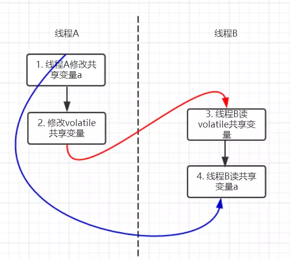
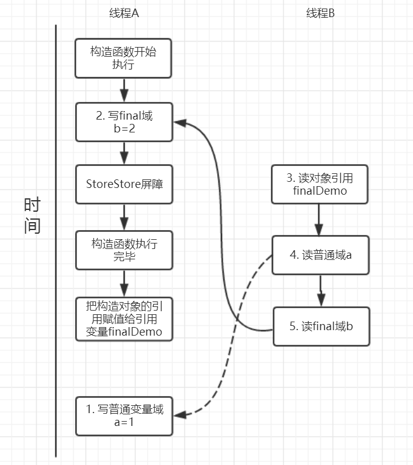

# 第三章 并发框架(一) 多线程原理


## 3.1 从面试题入手多线程

1. 多线程的出现解决了什么问题
2. 线程不安全指什么
3. 并发出现线程不安全的本质是什么
4. java如何解决并发问题
5. 线程安全是非真即假的吗？
6. 线程安全有哪些实现思路
7. 如何理解并发和并行的区别

### 3.1.1 多线程的出现解决了什么问题

计算机中cpu  内存 硬盘的运行速度是有巨大差异的，多线程可以合理利用cpu的高性能，平衡三者的差异，（计算机体系结构，操作系统，编译程序也为了平衡速度差异做了优化）但是也由此带来了新的问题

+ cpu增加了高速缓存--》造成了线程的**可见性**问题
+ 操作系统引入进程/线程概念，分时复用cpu--》造成了**原子性**问题
+ 编译程序添加了指令重排序优化--》造成**有序性**问题

### 3.1.2 线程不安全指什么

多个线程并行或者并发修改同一个变量时 会引起实际结果和理想结果不同

### 3.1.3 并发出现线程不安全的本质是什么

可见性:由cpu缓存引起->线程缓存之间互相不可见造成线程的修改对其他线程不可见,引起可见性问题

原子性:由cpu分时复用引起->转账操作中a账户减钱和b账户加钱应该是原子性的(要么一起成功要么一起失败),cpu分时复用(cpu在各个线程之间切换可能会在两个操作之间从而破坏原子性)引起原子性问题

有序性:指令重排序引起->在执行程序时为了提高性能,可能会有三种重排序

1. 编译器优化重排序
2. 处理器的指令级并行重排序
3. 内存系统重排序(因为处理器中有读/写缓存,使得加载和存储操作看上去是乱序的)

上述的 1 属于编译器重排序，2 和 3 属于处理器重排序。这些重排序都可能会导致多线程程序出现内存可见性问题。对于编译器，JMM 的编译器重排序规则会禁止特定类型的编译器重排序（不是所有的编译器重排序都要禁止）。对于处理器重排序，JMM 的处理器重排序规则会要求 java 编译器在生成指令序列时，插入特定类型的内存屏障（memory barriers，intel 称之为 memory fence）指令，通过内存屏障指令来禁止特定类型的处理器重排序（不是所有的处理器重排序都要禁止）。

### 3.1.4 java如何解决并发问题

JMM(java memory model ) java内存模型规范了jvm如何提供按需禁用缓存和编译器优化的方法,具体包括以下:

+ volatile,synchronized,final关键字
+ happens-before规则

如何解决的可见性,原子性,有序性问题?

1. 可见性:volatile关键字来保证可见性,被volatile修饰的变量被修改时会直接更新到主存,其他线程读取时也会直接从主存读取(synchronized和lock也可以保证可见性,因为释放锁之前会将变量修改更新到主存中)
2. 原子性:java使用synchronized和lock保证原子性,两个关键字保证了同一时间只有一个线程执行指令,从而保证了原子性
3. 有序性:volatile可以保证一定程度的有序性,synchronized和lock可以保证单线程执行,相当于保证了有序性,以上是java中保证有序性的手段,JMM中通过happens-before规则保证有序性

#### 3.1.4.1 Happens-Before规则

1.单一线程原则:在一个线程内，在程序前面的操作先行发生于后面的操作。

2.管程锁定规则:一个 unlock 操作先行发生于后面对同一个锁的 lock 操作。

3.volatile变量规则:对一个 volatile 变量的写操作先行发生于后面对这个变量的读操作。

4.线程启动规则:Thread对象的start方法调用先发生于此线程的每一个动作

5.线程加入规则:Thread对象的结束先行发生于join方法返回

6.线程中断规则:对线程interrupt()方法的调用先行发生于被中断线程的代码检测到中断事件的发生,可通过interrupt()方法检测到是否有中断发生

7.对象终结规则:一个对象的初始化完成(构造函数执行结束)先行发生于它的finalize()方法的开始

8.传递性:如果操作a先发生于操作b,操作b先发生于操作c,那么操作a先发生于操作c

### 3.1.5 线程安全:不是一个非真即假的命题

可以将共享数据按照安全程度的强弱顺序来分成以下五类:不可变,绝对线程安全,相对线程安全,线程兼容,线程对立

1. 不可变:final修饰的基本数据类型,string,枚举类型,number部分子类,集合类型可以通过 Collections.unmodifiableXXX()获取一个不可变集合,获取的集合如果修改直接抛异常

2. 绝对线程安全:不管运行时环境如何，调用者都不需要任何额外的同步措施。

3. 相对线程安全:相对线程安全需要保证对这个对象单独的操作是线程安全的,调用时不需要额外的线程安全措施,但是对于特定顺序的连续调用,依然需要额外的同步手段来保证调用的正确性,java中线程安全的对象就是这种例如 Vector,HashTable,Collections的synchronizedCollection()方法包装的集合等

   以下为需要额外代码保证正确运行的案例

   ```java
   public class VectorUnsafeExample {
       private static Vector<Integer> vector = new Vector<>();
       public static void main(String[] args) {
           while (true) {
               for (int i = 0; i < 100; i++) {
                   vector.add(i);
               }
               ExecutorService executorService = Executors.newCachedThreadPool();
               executorService.execute(() -> {
                   for (int i = 0; i < vector.size(); i++) {
                       vector.remove(i);
                   }
               });
               executorService.execute(() -> {
                   for (int i = 0; i < vector.size(); i++) {
                       vector.get(i);
                   }
               });
               executorService.shutdown();
           }
       }
   }
   //结果报错
   Exception in thread "Thread-159738" java.lang.ArrayIndexOutOfBoundsException: Array index out of range: 3
       at java.util.Vector.remove(Vector.java:831)
       at VectorUnsafeExample.lambda$main$0(VectorUnsafeExample.java:14)
       at VectorUnsafeExample$$Lambda$1/713338599.run(Unknown Source)
       at java.lang.Thread.run(Thread.java:745)
   //解决方案
   executorService.execute(() -> {
       synchronized (vector) {
           for (int i = 0; i < vector.size(); i++) {
               vector.remove(i);
           }
       }
   });
   executorService.execute(() -> {
       synchronized (vector) {
           for (int i = 0; i < vector.size(); i++) {
               vector.get(i);
           }
       }
   });
   ```

4. 线程兼容:线程兼容是指类对象本身不是线程安全的但是可以通过同步手段保证对象在并发环境中安全的使用,java中大多数线程不安全的对象就是这种例如 ArrayList HashMap

5. 线程对立:线程对立是指无论使用任何线程安全手段都无法保证线程安全的代码,由于java语言具有多线程特性,此种代码在java中很少见

### 3.1.6 线程安全的实现方法

1. 互斥同步

   synchronized和reentrantlock

2. 非阻塞同步

   CAS 乐观锁 (ABA问题)

3. 无同步方案

   + 栈封闭:其实就是方法的局部变量是分配到栈上的,线程私有,不存在线程并发问题

   + 线程本地存储(Thread Local Storage):实际和栈封闭一样 本质是把变量控制在一个线程范围之内,不存在线程间通信的情况,(注意:在一些场景下尤其是线程池,因为ThreadLocal.ThreadLocalMap的底层数据结构有内存泄露的风险,应该每次使用ThreadLocal后手动调用remove()方法以避免以上问题)

     

   + 可重入代码(Reentrant Code):这种代码也叫做纯代码(Pure Code)，可以在代码执行的任何时刻中断它，转而去执行另外一段代码(包括递归调用它本身)，而在控制权返回后，原来的程序不会出现任何错误。

     可重入代码有一些共同的特征，例如不依赖存储在堆上的数据和公用的系统资源、用到的状态量都由参数中传入、不调用非可重入的方法等。

### 3.1.7 如何理解并行和并发

并行是多个cpu同时执行,并发是cpu通过切换线程的方式营造出一种同时执行的假象,例如:2个cpu执行4个线程 属于并行并发

java中无法指定线程并发/并行执行(由操作系统决定)

## 3.2 线程基础

### 3.2.1 线程的状态


+ 新建(New)

  线程创建后尚未启动

+ 可运行(Runnable)

  等待cpu时间片或正在运行,包含操作系统线程状态中的Ready和Running

+ 阻塞(Blocking)

  等待获取排它锁,其他线程释放锁时此状态改变

+ 限期等待(Time Waiting)

  常见的是Thread.sleep(),一定时间后被系统自动唤醒,不需要其他线程显式唤醒

  |        进入方法         |                  退出方法                   |
  | :---------------------: | :-----------------------------------------: |
  |     Thread.sleep()      |                  时间结束                   |
  |    Object.wait(xxx)     | 时间结束/Object.notify()/Object.notifyAll() |
  |    Thread.join(xxx)     |          时间结束/目标线程执行完毕          |
  | LockSupport.parkNanos() |                                             |
  | LockSupport.parkUntil() |                                             |

+ 无限期等待(waiting)

  需要被其他线程显式唤醒

  |      进入方法      |              退出方法              |
  | :----------------: | :--------------------------------: |
  |   Object.wait()    | Object.notify()/Object.notifyAll() |
  |   Thread.join()    |            目标线程结束            |
  | LockSupport.park() |                                    |

+ 死亡(Terminated)

  正常或因异常结束

### 3.2.2 线程的使用方式

1. Runnable接口(无返回值)

```java
public class MyRunnable implements Runnable {
    public void run() {
        // ...
    }
    public static void main(String[] args) {
        MyRunnable instance = new MyRunnable();
        Thread thread = new Thread(instance);
        thread.start();
	}
}
```

2. Callable接口(有返回值)

```java
public class MyCallable implements Callable<Integer> {
    public Integer call() {
        return 123;
    }
    public static void main(String[] args) throws ExecutionException, InterruptedException {
        MyCallable mc = new MyCallable();
        FutureTask<Integer> ft = new FutureTask<>(mc);
        Thread thread = new Thread(ft);
        thread.start();
        System.out.println(ft.get());
    }

}
```

3. 继承Thread类(java不支持多重继承,此方法缺乏灵活性,不建议使用)

```java
public class MyThread extends Thread {
    public void run() {
        // ...
    }
    public static void main(String[] args) {
        MyThread mt = new MyThread();
        mt.start();
    }
}

```

### 3.2.3 基础线程机制

1. Executor

   Executor管理多个互不干扰的异步任务的执行,无法进行同步操作,Executor是一个接口,有多个具体实现

   + CachedThreadPool:一个任务创建一个线程

   + FixedThreadPool:固定数量的线程池执行所有任务

   + SingleThreadPool:单线程执行所有任务

     ```java
     public static void main(String[] args) {
         ExecutorService executorService = Executors.newCachedThreadPool();
         for (int i = 0; i < 5; i++) {
             executorService.execute(new MyRunnable());
         }
         executorService.shutdown();
     }
     ```

2. Daemon

   守护线程是后台提供服务的线程,程序终止会杀死所有守护线程

   ```java
   public static void main(String[] args) {
       Thread thread = new Thread(new MyRunnable());
       thread.setDaemon(true);
   }
   ```

3. sleep()

   Thread.sleep()方法可能会抛出InterruptedException异常,需要手动处理,线程睡眠过程中不会释放锁,但是会让出cpu时间片执行其他线程

4. yield()

   Thread.yield()方法只是给线程调度器一个建议,建议具有相同优先级的其他线程优先执行

### 3.2.4 线程中断

+ InterruptedException

  当调用线程的interrupt()方法,如果该线程处于阻塞/限期等待/无限期等待状态,会抛出InterruptedException异常,立刻结束该线程(该方法不能中断i/o阻塞和synchronized锁阻塞)

  但是如果该线程处于running状态,只能通过在run()方法中通过调用interrupted()方法获取中断标志位来判断决定是否退出线程(interrupt()方法本质上就是设置线程的中断标志位,阻塞时程序自动监测,正常执行时需要代码手动监测,详情见以下代码)

  ```java
  public class InterruptExample {
      private static class MyThread1 extends Thread {
          @Override
          public void run() {
              try {
                  Thread.sleep(2000);
                  System.out.println("Thread run");
              } catch (InterruptedException e) {
                  e.printStackTrace();
              }
          }
      }
      public static void main(String[] args) throws InterruptedException {
          Thread thread1 = new MyThread1();
          thread1.start();
          thread1.interrupt();
          System.out.println("Main run");
      }
  }
  //结果 不需要等2s就会立刻结束线程
  Main run
  java.lang.InterruptedException: sleep interrupted
      at java.lang.Thread.sleep(Native Method)
      at InterruptExample.lambda$main$0(InterruptExample.java:5)
      at InterruptExample$$Lambda$1/713338599.run(Unknown Source)
      at java.lang.Thread.run(Thread.java:745)
  ```

  ```java
  public class InterruptExample {
      private static class MyThread2 extends Thread {
          @Override
          public void run() {
              while (!interrupted()) {
                  // ..
              }
              System.out.println("Thread end");
          }
      }
      public static void main(String[] args) throws InterruptedException {
          Thread thread2 = new MyThread2();
          thread2.start();
          thread2.interrupt();
      }
  }
  //结果
  Thread end
  ```

  

### 3.2.5 Executor的中断操作

调用Executor的shutdown()方法会等待线程执行完成之后再关闭,shutdownNow()方法本质是调用每个线程的interrupt()方法

**Executor中断单个线程**

ExecutorService.submit()方法支持接受一个线程(runnable/callable)的作为参数并返回一个Future<?>对象,可以通过Future.cancel(true)方法中断线程

### 3.2.6 线程互斥同步

java提供两种锁机制来控制多线程对共享资源的互斥访问,一个是jvm实现的synchronized关键字,一个是jdk实现的ReentrantLock,这两个请见后面详解

先说synchronized和ReentrantLock的比较

1. 锁的实现方式

   synchronized是jvm实现的,ReentrantLock是jdk实现的

2. 性能

   jdk8以后对synchronized进行了大幅优化,例如自旋锁等现在二者性能大致相同

3. 等待可中断

   当持有锁的线程长期不释放锁对象时,正在等待的线程可以选择放弃等待,改为处理其他事情

   synchronized不支持,ReentrantLock支持

4. 公平锁

   synchronized和ReentrantLock默认都是非公平锁

   synchronized不支持公平锁,ReentrantLock支持公平锁

5. 锁绑定多个条件

   synchronized不支持,ReentrantLock通过Condition实现绑定多个条件

**选择**

除非使用ReentrantLock的高级功能否则建议synchronized,因为synchronized是jvm实现,收到原生支持,ReentrantLock不受所有jdk版本支持,synchronized不用担心释放锁的问题,jvm会自动释放,ReentrantLock需要手动释放锁

### 3.2.7 线程之间的协作

#### 3.2.7.1  join()

线程a调用线程b的join()方法,线程 a挂起直到线程b结束运行

#### 3.2.7.2  wait()/notify()/notifyAll()

wait()/notify()/notifyAll()是Object的方法,只能使用在同步方法/同步代码块中,否则会抛出illegalMonitorStateExeception异常

调用wait()方法时线程会释放锁并且进入waiting状态,调用notify()/notifyAll()会使锁上的其他线程从waiting状态进入blocking状态

**wait()和sleep()区别**

wait会释放锁 sleep不会释放锁,但会放弃cpu时间片

wait是Object的方法 sleep是Thread的静态方法

#### 3.2.7.3 await()/signal()/signalAll()

juc中提供了Condition类来实现线程间的协调,相比于wait(),await()可以指定特定的condition,因此更加灵活

## 3.3 synchronized关键字详解

**大厂面试题**

1. synchronized可以用在什么地方
2. synchronized本质上是通过什么保证线程安全的
3. synchronized有什么缺陷?java lock如何弥补
4. synchronized和Lock对比
5. synchronized使用注意事项
6. synchronized修饰的方法抛出异常会释放锁吗?
7. 多个线程等待同一个synchronized锁时,jvm如何选择下一个获取锁的线程
8. synchronized使得同时只有一个线程可以执行,性能很差,如何提升
9. 我想更灵活的控制锁的释放和获取(释放锁和获取锁的时机被规定死),怎么办
10. 什么是锁的升级和降级?什么是jvm里的偏向锁,轻量级锁,重量级锁

### 3.3.1  synchronized用法

synchronized关键字 可以修饰 静态方法(锁类对象),普通方法(实例对象),代码块(可以指定类对象/实例对象)

### 3.3.2 synchronized本质是通过什么保证线程安全的

通过Monitor对象来实现锁

```java
public class SynchronizedDemo2 {
    Object object = new Object();
    public void method1() {
        synchronized (object) {
        }
        method2();
    }
    private static void method2() {

    }
}
```

反编译后得到指令集:


根据指令集得知,上锁的指令是Monitorenter指令,退出指令是Monitorexit指令

每个对象同一时间只能和一个Monitor对象关联,每一个Monitor同一时间只能被一个线程获取

Monitor对象中有一个锁计数器,当没有线程获取时时0,当线程获取锁对象时,锁计数器+1,此时其他线程想获取锁对象就必须等待当前线程释放锁,Monitor对象锁可重入,重入时不需要再次获取对象(不需要重复获取锁),只需要锁计数器+1就行,每次执行Mmontorexit指令锁计数器-1,获取锁对象失败的线程会进入Montor对象的同步队列中blocked


### 3.3.3 synchronized有什么缺陷?lock对象如何弥补

synchronized缺陷:

1. 效率低:锁的释放情况少,只有代码执行完或者异常才会释放锁,lock对象可以设置中断和超时时间
2. 不够灵活:加锁和释放锁时机单一,只能绑定到一个对象上,lock可以绑定到多个condition对象上来灵活的协调多线程
3. 无法得知获取锁是否成功:lock可以设置获取锁成功/失败的情况

ReentrantLock的lockInterrupteibly()方法可以优先考虑响应中断,如果线程等待时间过长,就会中断自身,可以避免synchronized可能会出现的死锁问题

### 3.3.4  synchronized和Lock对比

上面已经讲过,参考3.2.6

### 3.3.5 synchronized注意事项

1. 锁对象不能为空
2. 所用域尽可能的小已提升效率
3. 避免死锁
4. 可以使用juc类情况下尽量少用synchronized和lock

### 3.3.6 synchronized抛出异常会释放锁吗?

根据3.3.2反编译后的指令级14行是异常情况下释放锁的指令

### 3.3.7 多个线程等待同一个synchronized锁时,jvm如何选择下一个获取锁的线程

这个问题涉及到内部锁的调用机制,和具体的虚拟机版本有关系,所以获取下一个锁的线程是无法预测的

### 3.3.8 synchronized使得同时只有一个线程可以执行,性能很差,如何提升

1. 尽量减少synchronized的使用范围,优化效率
2. 虽然1.6之后的synchronized有了大量优化,但是在特定情况下,还是不如(读写锁)更加轻量级的锁效率高,选择合适的锁

### 3.3.9  我想更灵活的控制锁的释放和获取(释放锁和获取锁的时机被规定死),怎么办

根据自己的需求实现lock接口来灵活控制锁的获取和释放

### 3.3.10  什么是锁的升级和降级?什么是jvm里的偏向锁,轻量级锁,重量级锁

jvm中monitorenter和monitorexit指令依赖于底层操作系统的Mutex Lock来实现,需要将当前线程挂起并从用户态切换到内核态来执行,代价非常昂贵

在jdk1.6中对锁的实现引入的大量的优化,锁的状态被分为4种:

1. 无锁状态
2. 偏向锁
3. 轻量级锁
4. 重量级锁

随着竞争升级锁状态从1->4膨胀,此过程不可逆

jdk1.6中对synchronized的优化包括 **锁粗化,锁消除,自旋锁,自适应自旋锁,偏向锁,轻量级锁**

1. 锁粗化

   如果代码中存在对一个对象的反复加锁解锁(甚至存在于循环中),这种加锁和释放锁的操作性能很差,所以会直接粗化为对整个代码加锁来提升性能

2. 锁消除

   锁消除是代码编译时,代码要求加锁,编译器基于逃逸分析的数据支持发现数据不可能被其他线程访问,也就没必要加锁,从而自动将锁消除,大多数情况下我们是可以判断是否需要加解锁的,但是很多api方法是线程同步的例如以下代码

   ```java
   public static String test03(String s1, String s2, String s3) {
       String s = s1 + s2 + s3;
       return s;
   }
   ```

   

   jdk1.5前会使用stringbuffer来append的字符串,1.6之后会优化为stringbuilder

3. 自旋锁

   HotSpot团队发现锁的锁定状态其实只有很短的时间,但是上锁和解锁却是很重的操作,所以当线程获取锁失败时,使用cas(compare and swap)算法(需要cpu指令级支持)来不断重试获取,是一种乐观锁,不会放弃cpu的时间片

   自旋锁基于可以短时间获取锁的假设,如果长时间占用cpu将非常消耗性能,因此自旋锁会默认10次循环,用户可以使用参数`-XX:PreBlockSpin`来更改,失败后会膨胀为更重量级的锁

4. 自适应自旋锁

   自适应自旋锁顾名思义就是自选的次数不固定,由上一次在同一个锁上的自旋时间和锁拥有者的状态决定

5. 偏向锁

   偏向锁是假设线程竞争比较宽松的情况,只有一个线程获取锁的时候效率和无锁基本相当,当线程获取同步块并获取锁时,会在对象头中和栈帧中的锁记录里存储偏向锁线程的ID(cas),以后该线程进入和退出同步块的时候不需要cas操作来加锁/解锁,只需要简单的查看对象头的mark word里是否存储当前线程的偏向锁**偏向锁的撤销**

   偏向锁不会主动撤销,只有其他线程尝试获取偏向锁时,持有锁的线程才会释放锁,偏向锁的撤销需要等到全局安全点(就是当前线程没有正在执行的字节码),首先检查持有偏向锁的线程是否存活,如果不处于存活状态,直接修改对象头为无锁状态,如果存活,暂停拥有偏向锁的线程,将对象头标志位改为01(无锁)或00(轻量级锁)状态,被暂停的线程继续

6. 轻量级锁

   1. 代码进入同步块的时候,如果同步对象为无锁状态,虚拟机先在线程栈帧中创建一个LockRecord(锁记录空间),用于存储对象的MarkWord拷贝,官方称为Displace Mark Word

   2. 拷贝对象头的Mark Word到LockRecord中

   3. 拷贝成功后,虚拟机通过cas操作将对象头的MarkWord指向当前线程的lockRecord,并将LockRecord里的owner指针指向对象头的MarkWord,如果成功了执行4,失败了执行5

   4. 如果操作成功了,将LockRecord的标志位改为00

   5. 如果失败了,虚拟机检测对象头中markword是否指向当前线程的栈帧,如果是说明当前线程已经获取了锁,直接执行代码块,否则说明多个线程竞争,轻量级锁膨胀为重量级锁,锁标志位变为10,MarkWord指向的是重量级锁(互斥量)的指针,当前线程通过自旋获取锁,之后的线程进入阻塞状态

      

      

   轻量级锁的膨胀流程

   ​	轻量级锁释放锁时会尝试通过cas将对象头标志位从00->01如果失败说明有竞争线程并且已经膨胀为重量级锁,此时需要释放锁并且唤醒同步队列中的阻塞线程

   

   **锁的对比**

   |    锁    |               优点                |                             缺点                             |                  使用场景                  |
   | :------: | :-------------------------------: | :----------------------------------------------------------: | :----------------------------------------: |
   |  偏向锁  |     效率和非同步方法差距很小      |        如果有竞争,需要暂停线程,会带来额外的锁撤销消耗        | 适合极少竞争而且同步代码执行时间较短的情况 |
   | 轻量级锁 | 竞争的线程不会阻塞,提升了响应速度 | 如果持有锁的线程长时间不释放锁,自旋锁会占用大量的时间片消耗cpu性能 |     追求响应速度且同步代码执行时间较短     |
   | 重量级锁 |  线程竞争不使用自旋不占用cpu性能  |            线程阻塞效率低,获取/释放锁消耗性能巨大            |     追求吞吐量且同步代码需要长时间执行     |

   

​		

## 3.4 volatile关键字

### 3.4.1 面试题

1. volatile关键字的作用是什么
2. volatile能保证原子性吗
3. 之前32位机器上的共享long和double为什么要用volatile?现在64位机器上是否也要设置
4. volatile修饰i情况下  i++为什么不能保证原子性
5. volatile如何实现可见性
6. volatile如何实现有序性
7. volatile使用场景

### 3.4.2 volatile作用是什么

volatile可以保证共享变量的可见性,和一定程度的有序性,无法保证完全原子性,只能保证单词读写有原子性

1. 防重排序:double check lock问题

   ```java
   public class Singleton {
       public static volatile Singleton singleton;
       //需要添加volatile来防止重排序引起的singleton对象未初始化就被引用的问题
       /**
        * 构造函数私有，禁止外部实例化
        */
       private Singleton() {};
       public static Singleton getInstance() {
           if (singleton == null) {
               synchronized (singleton.class) {
                   if (singleton == null) {
                       singleton = new Singleton();
                   }
               }
           }
           return singleton;
       }
   }
   ```

2. 可见性

   被volatile修饰的共享变量在线程修改时会直接更新共享内存,在读取时也会直接从共享内存读取

### 3.4.3  volatile能保证原子性吗

volatile只能保证单个读/写操作的原子性

### 3.4.4  之前32位机器上的共享long和double为什么要用volatile?现在64位机器上是否也要设置

因为32位处理器中long和double两种数据类型的分为高32位和低32位两部分,因此普通的long和double类型读写不是原子的,所以添加volatile关键字保证原子性,现在普遍是64位处理器,所以一般的64位数据直接就是原子操作了,无需添加volatile关键字

### 3.4.5  volatile修饰i情况下  i++为什么不能保证原子性

i++ 分为

+ 读取i
+ i+1
+ 将结果值赋值给i

volatile可以保证单个操作的原子性,不能保证三个操作的原子性(可能有两个线程同时执行+1操作,这两个操作都是原子性的然后将同样的值赋值给i)

### 3.4.6 volatile如何实现可见性

使用volatile修饰的变量会在写操作时添加lock前缀

```
public class Test {
    private volatile int a;
    public void update() {
        a = 1;
    }
    public static void main(String[] args) {
        Test test = new Test();
        test.update();
    }
}
//编译为汇编代码后
......
  0x0000000002951563: and    $0xffffffffffffff87,%rdi
  0x0000000002951567: je     0x00000000029515f8
  0x000000000295156d: test   $0x7,%rdi
  0x0000000002951574: jne    0x00000000029515bd
  0x0000000002951576: test   $0x300,%rdi
  0x000000000295157d: jne    0x000000000295159c
  0x000000000295157f: and    $0x37f,%rax
  0x0000000002951586: mov    %rax,%rdi
  0x0000000002951589: or     %r15,%rdi
  0x000000000295158c: lock cmpxchg %rdi,(%rdx)  //在 volatile 修饰的共享变量进行写操作的时候会多出 lock 前缀的指令
  0x0000000002951591: jne    0x0000000002951a15
  0x0000000002951597: jmpq   0x00000000029515f8
  0x000000000295159c: mov    0x8(%rdx),%edi
  0x000000000295159f: shl    $0x3,%rdi
  0x00000000029515a3: mov    0xa8(%rdi),%rdi
  0x00000000029515aa: or     %r15,%rdi
......
```

lock指令会在多核处理器情况下引发以下两件事情:

1. 将当前处理器缓存行的数据写回系统内存
2. 写回内存的操作会使其他cpu里缓存的这个内存的数据失效(通过缓存一致性协议)

**lock指令**

早起处理中,lock前缀会使处理器产生一个lock#信号会锁定总线,会阻塞其他cpu对内存的读写请求,直到锁释放,后来的处理器,加锁操作是由高速缓存锁代替总线锁处理,因为锁总线的开销太大,锁期间其他cpu无法访问内存,这种场景多缓存的数据一致通过缓存一致性协议(mesi)保证

**缓存一致性协议**

cpu缓存是分段的,一段对应一块存储空间,称为缓存行,它是cpu缓存中可分配的最小存储单位大小32字节/64字节/128字节不等.

缓存一致性协议有多重,大多数是"嗅探"协议,缓存本身是独立的,但是内存是共享的,所有内存的访问都要通过仲裁(同一个指令周期中,只有一个cpu缓存可以读写内存).cpu缓存不光在内存传输时和总线交互,还在不停嗅探总线上发生的数据交互跟踪其他缓存变化.当一个缓存修改内存数据时,其他缓存也会得到通知,使自己对该内存的缓存行失效

### 3.4.6 volatile如何实现有序性

#### 3.4.6.1 volatile的happens-before关系

happens-before中有一条volatile规则:对volatile变量的写happens-before于任意后续对其读

```java
//假设线程A执行writer方法，线程B执行reader方法
class VolatileExample {
    int a = 0;
    volatile boolean flag = false;
    
    public void writer() {
        a = 1;              // 1 线程A修改共享变量
        flag = true;        // 2 线程A写volatile变量
    } 
    
    public void reader() {
        if (flag) {         // 3 线程B读同一个volatile变量
        int i = a;          // 4 线程B读共享变量
        ……
        }
    }
}
```



基于volatile happens-before规则可以得出红线,根据红线推导出蓝线 所以步骤1一定先于步骤4

#### 3.4.6.2 volatile禁止重排序

jvm在不改变正确语义的前提下允许编译器和指令级进行重排序,volatile提供了内存屏障阻止重排序


jmv采用保守策略

- 在每个 volatile 写操作的前面插入一个 StoreStore 屏障。

- 在每个 volatile 写操作的后面插入一个 StoreLoad 屏障。

- 在每个 volatile 读操作的后面插入一个 LoadLoad 屏障。

- 在每个 volatile 读操作的后面插入一个 LoadStore 屏障。

  |    内存屏障     |                            说明                             |
  | :-------------: | :---------------------------------------------------------: |
  | StoreStore 屏障 |        禁止上面的普通写和下面的 volatile 写重排序。         |
  | StoreLoad 屏障  | 防止上面的 volatile 写与下面可能有的 volatile 读/写重排序。 |
  |  LoadLoad 屏障  |    禁止下面所有的普通读操作和上面的 volatile 读重排序。     |
  | LoadStore 屏障  |    禁止下面所有的普通写操作和上面的 volatile 读重排序。     |

  

  

### 3.4.7 volatile的应用场景

+ 对变量的写操作不依赖当前值
+ 该变量没有包含在具有其他变量的不变式中
+ 只有在状态真正独立于程序其他内容时才能使用volatile

模式1:状态标志

```java
volatile boolean shutdownRequested;
......
public void shutdown() { shutdownRequested = true; }
public void doWork() { 
    while (!shutdownRequested) { 
        // do stuff
    }
}
```

模式2:一次性安全发布

缺乏同步会导致无法实现可见性，这使得确定何时写入对象引用而不是原始值变得更加困难。在缺乏同步的情况下，可能会遇到某个对象引用的更新值(由另一个线程写入)和该对象状态的旧值同时存在。(这就是造成著名的双重检查锁定(double-checked-locking)问题的根源，其中对象引用在没有同步的情况下进行读操作，产生的问题是您可能会看到一个更新的引用，但是仍然会通过该引用看到不完全构造的对象)。

```java
public class BackgroundFloobleLoader {
    public volatile Flooble theFlooble;
 
    public void initInBackground() {
        // do lots of stuff
        theFlooble = new Flooble();  // this is the only write to theFlooble
    }
}
public class SomeOtherClass {
    public void doWork() {
        while (true) { 
            // do some stuff...
            // use the Flooble, but only if it is ready
            if (floobleLoader.theFlooble != null) 
                doSomething(floobleLoader.theFlooble);
        }
    }
}
```

模式3：独立观察(independent observation)

安全使用 volatile 的另一种简单模式是定期 发布 观察结果供程序内部使用。例如，假设有一种环境传感器能够感觉环境温度。一个后台线程可能会每隔几秒读取一次该传感器，并更新包含当前文档的 volatile 变量。然后，其他线程可以读取这个变量，从而随时能够看到最新的温度值。

```java
public class UserManager {
    public volatile String lastUser;
    public boolean authenticate(String user, String password) {
        boolean valid = passwordIsValid(user, password);
        if (valid) {
            User u = new User();
            activeUsers.add(u);
            lastUser = user;
        }
        return valid;
    }
}
```

模式4：volatile bean 模式

```java
@ThreadSafe
public class Person {
    private volatile String firstName;
    private volatile String lastName;
    private volatile int age;
    public String getFirstName() { return firstName; }
    public String getLastName() { return lastName; }
    public int getAge() { return age; }
    public void setFirstName(String firstName) { 
        this.firstName = firstName;
    }
    public void setLastName(String lastName) { 
        this.lastName = lastName;
    }
    public void setAge(int age) { 
        this.age = age;
    }
}
```

模式5：开销较低的读－写锁策略

volatile 的功能还不足以实现计数器。因为 ++x 实际上是三种操作(读、添加、存储)的简单组合，如果多个线程凑巧试图同时对 volatile 计数器执行增量操作，那么它的更新值有可能会丢失。 如果读操作远远超过写操作，可以结合使用内部锁和 volatile 变量来减少公共代码路径的开销。 安全的计数器使用 synchronized 确保增量操作是原子的，并使用 volatile 保证当前结果的可见性。如果更新不频繁的话，该方法可实现更好的性能，因为读路径的开销仅仅涉及 volatile 读操作，这通常要优于一个无竞争的锁获取的开销。

```java
@ThreadSafe
public class CheesyCounter {
    // Employs the cheap read-write lock trick
    // All mutative operations MUST be done with the 'this' lock held
    @GuardedBy("this") private volatile int value;
 
    public int getValue() { return value; }
 
    public synchronized int increment() {
        return value++;
    }
}
```

模式6：双重检查(double-checked)

单例模式的一种实现方式，但很多人会忽略 volatile 关键字，因为没有该关键字，程序也可以很好的运行，只不过代码的稳定性总不是 100%，说不定在未来的某个时刻，隐藏的 bug 就出来了。

```java
class Singleton {
    private volatile static Singleton instance;
    private Singleton() {
    }
    public static Singleton getInstance() {
        if (instance == null) {
            syschronized(Singleton.class) {
                if (instance == null) {
                    instance = new Singleton();
                }
            }
        }
        return instance;
    } 
}
```

## 3.5 final关键字

### 3.5.1 面试题

1. 所有的final修饰的字段都是编译期常量吗?
2. 如何理解private所修饰的方法时隐式final
3. 说说final类型的类如何拓展?比如string是final类型,我想写个mystring复用所有的string中方法,同时增加一个新的toMyString()的方法,应该怎么办
4. final方法可以被重载吗
5. 父类的final方法可以被子类重写吗
6. final域重排序规则
7. final原理
8. final的限制条件和局限性
9. 思考题

### 3.5.2 所有final修饰的字段都是编译期常量?  否

final修饰类->不能被继承

final修饰方法->不能重写可以重载

final修饰参数->无法在方法中修改参数引用所指向的对象

final修饰变量->

1. 普通变量

   ```java
   public class Test {
       //编译期常量
       final int i = 1;
       final static int J = 1;
       final int[] a = {1,2,3,4};
       //非编译期常量
       Random r = new Random();
       final int k = r.nextInt();
       public static void main(String[] args) {
       }
   }
   ```

2. static final

   ```java
   import java.util.Random;
   public class Test {
       static Random r = new Random();
       final int k = r.nextInt(10);
       static final int k2 = r.nextInt(10); 
       public static void main(String[] args) {
           Test t1 = new Test();
           System.out.println("k="+t1.k+" k2="+t1.k2);
           Test t2 = new Test();
           System.out.println("k="+t2.k+" k2="+t2.k2);
       }
   }
   //结果
   k=2 k2=7
   k=8 k2=7
   ```

   一个既是static又是final 的字段只占据一段不能改变的存储空间，它必须在定义的时候进行赋值，否则编译器将不予通过。

3. blank final

   Java允许生成空白final，也就是说被声明为final但又没有给出定值的字段,但是必须在该字段被使用之前被赋值，这给予我们两种选择：

   + 在定义处进行赋值(这不叫空白final)
   + 在构造器中进行赋值，保证了该值在被使用前赋值。

   注意，如果字段由static和final修饰，仅能在定义处赋值，因为该字段不属于对象，属于这个类。

### 3.5.3  如何理解private所修饰的方法时隐式final

类中所有private方法都隐式地指定为final的，由于无法取用private方法，所以也就不能覆盖它。可以对private方法增添final关键字，但这样做并没有什么好处。

### 3.5.4  说说final类型的类如何拓展?比如string是final类型,我想写个mystring复用所有的string中方法,同时增加一个新的toMyString()的方法,应该怎么办

装饰器模式,如下

```java
/**
* @pdai
*/
class MyString{
    private String innerString;
    // ...init & other methods
    // 支持老的方法
    public int length(){
        return innerString.length(); // 通过innerString调用老的方法
    }
    // 添加新方法
    public String toMyString(){
        //...
    }
}
```

### 3.5.5  final方法可以被重载吗  可以的

```java
public class FinalExampleParent {
    public final void test() {
    }
    public final void test(String str) {
    }
}

```

### 3.5.6  父类的final方法可以被子类重写吗

不能

### 3.5.7  final域重排序规则

示例代码

```java
public class FinalDemo {
    private int a;  //普通域
    private final int b; //final域
    private static FinalDemo finalDemo;

    public FinalDemo() {
        a = 1; // 1. 写普通域
        b = 2; // 2. 写final域
    }

    public static void writer() {
        finalDemo = new FinalDemo();
    }

    public static void reader() {
        FinalDemo demo = finalDemo; // 3.读对象引用
        int a = demo.a;    //4.读普通域
        int b = demo.b;    //5.读final域
    }
}
```

线程a执行writer()方法线程b执行reader()方法

#### 3.5.7.1 final域为基本类型情况

1. 写final域的重排序规则

   写final的重排序规则:禁止变量b的赋值被重排序到构造函数外面,从而保证b能够被正确赋值(a不能保证)

   写final域重排序规则可以确保:对象引用为任意线程可见之前,对象的final域已经被正确初始化,普通域无法保证

   

2. 读final域的重排序规则

   读final域重排序规则:禁止将读对象引用和读该对象包含的final域重排序(只有少数cpu可能出现这种情况)

   

   读final域的重排序规则可以确保：在读一个对象的final域之前，一定会先读这个包含这个final域的对象的引用。

#### 3.5.7.2 final域为基本类型情况

针对引用数据类型，final域写针对编译器和处理器重排序增加了这样的约束：在构造函数内对一个final修饰的对象的成员域的写入，与随后在构造函数之外把这个被构造的对象的引用赋给一个引用变量，这两个操作是不能被重排序的。注意这里的是“增加”也就说前面对final基本数据类型的重排序规则在这里还是使用。

```java
public class FinalReferenceDemo {
    final int[] arrays;
    private FinalReferenceDemo finalReferenceDemo;
    public FinalReferenceDemo() {
        arrays = new int[1];  //1
        arrays[0] = 1;        //2
    }
    public void writerOne() {
        finalReferenceDemo = new FinalReferenceDemo(); //3
    }
    public void writerTwo() {
        arrays[0] = 2;  //4
    }
    public void reader() {
        if (finalReferenceDemo != null) {  //5
            int temp = finalReferenceDemo.arrays[0];  //6
        }
    }
}
```

线程线程A执行wirterOne方法，执行完后线程B执行writerTwo方法，然后线程C执行reader方法。以下仅仅是可能的情况之一


由于对final域的写禁止重排序到构造方法外，因此1和3不能被重排序。由于一个final域的引用对象的成员域写入不能与随后将这个被构造出来的对象赋给引用变量重排序，因此2和3不能重排序。

注:线程abc是乱序执行的

**对final修饰对象的成员域的读操作**

在a线程final对象赋值给变量完成的情况下,JMM可以确保c线程可以看到a线程对final引用的对象的成员域的写入,即能看下arrays[0] = 1，而写线程B对数组元素的写入可能看到可能看不到。

***final重排序总结***

+ 基本数据类型:
  - final域写:final域写禁止重排序到构造方法之外,保证该对象对所以线程可见时,final域已经初始化过
  - final域读:禁止初次读对象的引用与读该对象包含的final域重排序
+ 引用类型:
  + 增加约束:禁止对final对象的成员域的写入与随后将此对象赋值给引用变量重排序

### 3.5.8 final原理

写final域会要求编译器在final域写之后，构造函数返回前插入一个StoreStore屏障。读final域的重排序规则会要求编译器在读final域的操作前插入一个LoadLoad屏障。

**final引用从构造函数中溢出问题**

```java
public class FinalReferenceEscapeDemo {
    private final int a;
    private FinalReferenceEscapeDemo referenceDemo;

    public FinalReferenceEscapeDemo() {
        a = 1;  //1
        referenceDemo = this; //2
    }
    public void writer() {
        new FinalReferenceEscapeDemo();
    }
    public void reader() {
        if (referenceDemo != null) {  //3
            int temp = referenceDemo.a; //4
        }
    }
}
```

以下是某种可能运行情况


假设一个线程A执行writer方法另一个线程执行reader方法。因为构造函数中操作1和2之间没有数据依赖性，1和2可以重排序，先执行了2，这个时候引用对象referenceDemo是个没有完全初始化的对象，而当线程B去读取该对象时就会出错。尽管依然满足了final域写重排序规则：在引用对象对所有线程可见时，其final域已经完全初始化成功。但是，引用对象“this”逸出，该代码依然存在线程安全的问题。

### 3.5.9 final 的限制条件和局限性

1. 当声明一个 final 成员时，必须在构造函数退出前设置它的值。
2. 将指向对象的成员声明为 final 只能将该引用设为不可变的，而非所指的对象。

### 3.5.10 思考

```java
byte b1=1;
byte b2=3;
byte b3=b1+b2;//当程序执行到这一行的时候会出错，因为b1、b2可以自动转换成int类型的变量，运算时java虚拟机对它进行了转换，结果导致把一个int赋值给byte-----出错
final byte b1=1;
final byte b2=3;
byte b3=b1+b2;//不会出错，相信你看了上面的解释就知道原因了。

```

