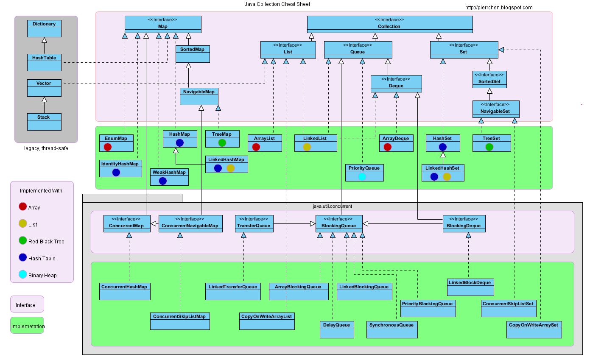
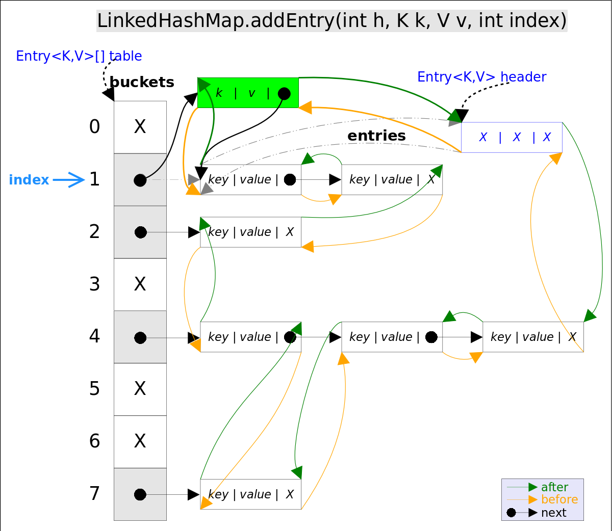

# 第二章 集合框架



## 2.1概述

- Collection
  - Set
    - TreeSet (基于红黑树，有序 查询效率为O（logN）  HashSet效率为O（1）)
    - HashSet（基于哈希表实现，无序）
    - LinkedHashSet（查询效率等于HashSet，使用双向链表维护插入顺序）
  - List
    - ArrayList（基于动态数字实现）
    - Vector（基于动态数组，线程安全）
    - LinkedList（基于双向链表，只能顺序访问）
  - Queue
    - LinkedList（可以用它来实现双向队列）
    - PriorityQueue（基于堆结构实现，用来实现优先队列）
- Map
  - TreeMap（基于红黑树）
  - HashMap（基于哈希表）
  - HashTable（基于哈希表 线程安全  遗留类  建议使用 ConcurrentHashMap）
  - LinkedHashMap（基于双向链表 有序）

## 2.2 ArrayList

arraylist默认长度是10 （注意和HashMap区分）当长度超过时 会扩容为原来的1.5倍

## 2.3 LinkedList

实现了Deque接口和Queue接口

```java
//Queue方法
 	public E peek() {
        final Node<E> f = first;
        return (f == null) ? null : f.item;
    }
    public E element() {
        return getFirst();
    }
    public E poll() {
        final Node<E> f = first;
        return (f == null) ? null : unlinkFirst(f);
    }
    public E remove() {
        return removeFirst();
    }
    public boolean offer(E e) {
        return add(e);
    }
```

```java
//Deque方法
	public boolean offerFirst(E e) {
        addFirst(e);
        return true;
    }
    public boolean offerLast(E e) {
        addLast(e);
        return true;
    }
    public E peekFirst() {
        final Node<E> f = first;
        return (f == null) ? null : f.item;
     }
    public E peekLast() {
        final Node<E> l = last;
        return (l == null) ? null : l.item;
    }
    public E pollFirst() {
        final Node<E> f = first;
        return (f == null) ? null : unlinkFirst(f);
    }
    public E pollLast() {
        final Node<E> l = last;
        return (l == null) ? null : unlinkLast(l);
    }
    public void push(E e) {
        addFirst(e);
    }
    public E pop() {
        return removeFirst();
    }
    public boolean removeFirstOccurrence(Object o) {
        return remove(o);
    }

    public boolean removeLastOccurrence(Object o) {
        if (o == null) {
            for (Node<E> x = last; x != null; x = x.prev) {
                if (x.item == null) {
                    unlink(x);
                    return true;
                }
            }
        } else {
            for (Node<E> x = last; x != null; x = x.prev) {
                if (o.equals(x.item)) {
                    unlink(x);
                    return true;
                }
            }
        }
        return false;
    }
```

## 2.4 ArrayDeque

底层使用了循环数组，也就是说数组的任何一点都可能被看作起点或者终点。


## 2.5 PriorityQueue

基于堆，注意完全二叉树的增删

[PriorityQueue](https://pdai.tech/md/java/collection/java-collection-PriorityQueue.html)

## 2.6 HashSet&HashMap

hashSet&HashMap初始容量 16 负载系数0.75 超过时容量*2

java7中使用数组+链表的结构

java8中使用数组+红黑树的结构(链表大于8个时变成红黑树)

## 2.7 LinkedHashSet&Map

LinkedHashMap在HashMap的基础上，采用双向链表(doubly-linked list)的形式将所有`entry`连接起来，这样是为保证元素的迭代顺序跟插入顺序相同。



### 2.7.1 LinkedHashMap经典用法

*LinkedHashMap*除了可以保证迭代顺序外，还有一个非常有用的用法: 可以轻松实现一个采用了FIFO替换策略的缓存。具体说来，LinkedHashMap有一个子类方法`protected boolean removeEldestEntry(Map.Entry<K,V> eldest)`，该方法的作用是告诉Map是否要删除“最老”的Entry，所谓最老就是当前Map中最早插入的Entry，如果该方法返回`true`，最老的那个元素就会被删除。在每次插入新元素的之后LinkedHashMap会自动询问removeEldestEntry()是否要删除最老的元素。这样只需要在子类中重载该方法，当元素个数超过一定数量时让removeEldestEntry()返回true，就能够实现一个固定大小的FIFO策略的缓存。示例代码如下:

```java
/** 一个固定大小的FIFO替换策略的缓存 */
class FIFOCache<K, V> extends LinkedHashMap<K, V>{
    private final int cacheSize;
    public FIFOCache(int cacheSize){
        this.cacheSize = cacheSize;
    }
    // 当Entry个数超过cacheSize时，删除最老的Entry
    @Override
    protected boolean removeEldestEntry(Map.Entry<K,V> eldest) {
       return size() > cacheSize;
    }
}
```

## 2.8 TreeMap&TreeSet

**红黑树是一种近似平衡的二叉查找树，它能够确保任何一个节点的左右子树的高度差不会超过二者中较低那个的一陪**。具体来说，红黑树是满足如下条件的二叉查找树(binary search tree):

1. 每个节点要么是红色，要么是黑色。
2. 根节点必须是黑色
3. 红色节点不能连续(也即是，红色节点的孩子和父亲都不能是红色)。
4. 对于每个节点，从该点至`null`(树尾端)的任何路径，都含有相同个数的黑色节点。

当查找树的结构发生改变时，红黑树的约束条件可能被破坏，需要通过调整使得查找树重新满足红黑树的约束条件。调整可以分为两类: 一类是颜色调整，即改变某个节点的颜色；另一类是结构调整，集改变检索树的结构关系。结构调整过程包含两个基本操作 : 左旋(Rotate Left)，右旋(RotateRight)。

### 2.8.1 左旋

左旋的过程是将`x`的右子树绕`x`逆时针旋转，使得`x`的右子树成为`x`的父亲，同时修改相关节点的引用。旋转之后，二叉查找树的属性仍然满足。


```java
//Rotate Left
private void rotateLeft(Entry<K,V> p) {
    if (p != null) {
        Entry<K,V> r = p.right;
        p.right = r.left;
        if (r.left != null)
            r.left.parent = p;
        r.parent = p.parent;
        if (p.parent == null)
            root = r;
        else if (p.parent.left == p)
            p.parent.left = r;
        else
            p.parent.right = r;
        r.left = p;
        p.parent = r;
    }
}
```


### 2.8.2 右旋

右旋的过程是将`x`的左子树绕`x`顺时针旋转，使得`x`的左子树成为`x`的父亲，同时修改相关节点的引用。旋转之后，二叉查找树的属性仍然满足。


```java
//Rotate Right
private void rotateRight(Entry<K,V> p) {
    if (p != null) {
        Entry<K,V> l = p.left;
        p.left = l.right;
        if (l.right != null) l.right.parent = p;
        l.parent = p.parent;
        if (p.parent == null)
            root = l;
        else if (p.parent.right == p)
            p.parent.right = l;
        else p.parent.left = l;
        l.right = p;
        p.parent = l;
    }
}
```

### 2.8.3 寻找节点后继

寻找比给定节点大的最小元素

1. t的右子树不空，则t的后继是其右子树中最小的那个元素。
2. t的右孩子为空，则t的后继是其第一个向右走的祖先。


```java
// 寻找节点后继函数successor()
static <K,V> TreeMap.Entry<K,V> successor(Entry<K,V> t) {
    if (t == null)
        return null;
    else if (t.right != null) {// 1. t的右子树不空，则t的后继是其右子树中最小的那个元素
        Entry<K,V> p = t.right;
        while (p.left != null)
            p = p.left;
        return p;
    } else {// 2. t的右孩子为空，则t的后继是其第一个向左走的祖先
        Entry<K,V> p = t.parent;
        Entry<K,V> ch = t;
        while (p != null && ch == p.right) {
            ch = p;
            p = p.parent;
        }
        return p;
    }
}
```

红黑树相关操作

[粗略参考文档](https://pdai.tech/md/java/collection/java-map-TreeMap&TreeSet.html)

## 2.9 WeakHashMap

弱引用会被gc掉,所以weakHashMap被用作缓存

[参考链接](https://pdai.tech/md/java/collection/java-map-WeakHashMap.html)
