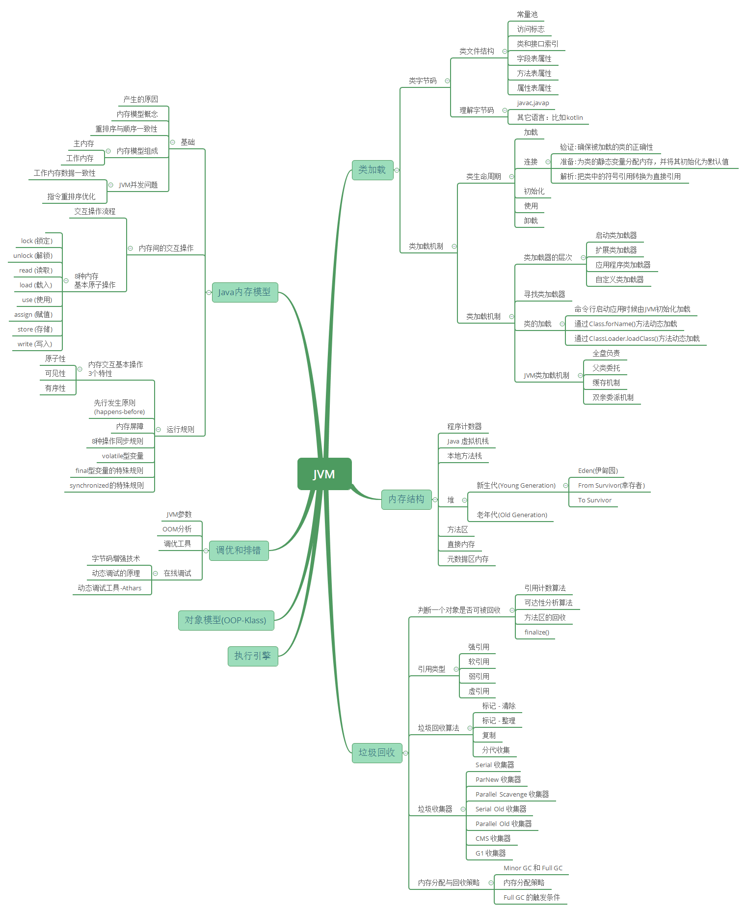
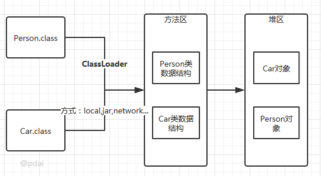

# 第五章 jvm相关



sun公司 hotspot虚拟机结构图如下(不同的JDK版本略有差别，这里主要以1.8为主)


## 1  jvm基础

## 1.1 字节码详解

### 1.1.1 多语言编译为字节码在JVM运行

计算机是不能直接运行java代码的，必须要先运行java虚拟机，再由java虚拟机运行编译后的java代码。这个编译后的java代码，就是本文要介绍的java字节码。

为什么jvm不能直接运行java代码呢，这是因为在cpu层面看来计算机中所有的操作都是一个个指令的运行汇集而成的，java是高级语言，只有人类才能理解其逻辑，计算机是无法识别的，所以java代码必须要先编译成字节码文件，jvm才能正确识别代码转换后的指令并将其运行。

- Java代码间接翻译成字节码，储存字节码的文件再交由运行于不同平台上的JVM虚拟机去读取执行，从而实现一次编写，到处运行的目的。
- JVM也不再只支持Java，由此衍生出了许多基于JVM的编程语言，如Groovy, Scala, Koltin等等。


### 1.1.2 Java字节码文件

class文件本质上是一个以8比特位的字节为基础单位的二进制流，各个数据项目严格按照顺序紧凑的排列在class文件中。jvm根据其特定的规则解析该二进制数据，从而得到相关信息。

Class文件采用一种伪结构来存储数据，它有两种类型：无符号数和表。这里暂不详细的讲。

本文将通过简单的java例子编译后的文件来理解。

### 1.1.3 class文件的结构属性


**class文件实例**

```java
//Main.java
public class Main {
    private int m;
    public int inc() {
        return m + 1;
    }
}
//编译命令
javac Main.java
```

结果为:


+ 因为结果是16进制 所以CA对应8个比特位即1字节 CA FE BA BE对应4字节的魔数,唯有以"cafe babe"开头的class文件方可被虚拟机所接受，这4个字节就是字节码文件的身份识别。
+ 0000是编译器jdk版本的次版本号0，0034转化为十进制是52,是主版本号，java的版本号从45开始，除1.0和1.1都是使用45.x外,以后每升一个大版本，版本号加一。也就是说，编译生成该class文件的jdk版本为1.8.0。

可以使用classview查看class文件


可以方便看到class文件的整个结构

### 1.1.4 反编译字节码

使用javap命令反编译class文件

`javap <options> <classes>`

```
  -help  --help  -?        输出此用法消息
  -version                 版本信息
  -v  -verbose             输出附加信息
  -l                       输出行号和本地变量表
  -public                  仅显示公共类和成员
  -protected               显示受保护的/公共类和成员
  -package                 显示程序包/受保护的/公共类
                           和成员 (默认)
  -p  -private             显示所有类和成员
  -c                       对代码进行反汇编
  -s                       输出内部类型签名
  -sysinfo                 显示正在处理的类的
                           系统信息 (路径, 大小, 日期, MD5 散列)
  -constants               显示最终常量
  -classpath <path>        指定查找用户类文件的位置
  -cp <path>               指定查找用户类文件的位置
  -bootclasspath <path>    覆盖引导类文件的位置

```

输入命令`javap -verbose -p Main.class`查看输出内容:

```java
Classfile /E:/JavaCode/TestProj/out/production/TestProj/com/rhythm7/Main.class
  Last modified 2018-4-7; size 362 bytes
  MD5 checksum 4aed8540b098992663b7ba08c65312de
  Compiled from "Main.java"
public class com.rhythm7.Main
  minor version: 0
  major version: 52
  flags: ACC_PUBLIC, ACC_SUPER
Constant pool:
   #1 = Methodref          #4.#18         // java/lang/Object."<init>":()V
   #2 = Fieldref           #3.#19         // com/rhythm7/Main.m:I
   #3 = Class              #20            // com/rhythm7/Main
   #4 = Class              #21            // java/lang/Object
   #5 = Utf8               m
   #6 = Utf8               I
   #7 = Utf8               <init>
   #8 = Utf8               ()V
   #9 = Utf8               Code
  #10 = Utf8               LineNumberTable
  #11 = Utf8               LocalVariableTable
  #12 = Utf8               this
  #13 = Utf8               Lcom/rhythm7/Main;
  #14 = Utf8               inc
  #15 = Utf8               ()I
  #16 = Utf8               SourceFile
  #17 = Utf8               Main.java
  #18 = NameAndType        #7:#8          // "<init>":()V
  #19 = NameAndType        #5:#6          // m:I
  #20 = Utf8               com/rhythm7/Main
  #21 = Utf8               java/lang/Object
{
  private int m;
    descriptor: I
    flags: ACC_PRIVATE

  public com.rhythm7.Main();
    descriptor: ()V
    flags: ACC_PUBLIC
    Code:
      stack=1, locals=1, args_size=1
         0: aload_0
         1: invokespecial #1                  // Method java/lang/Object."<init>":()V
         4: return
      LineNumberTable:
        line 3: 0
      LocalVariableTable:
        Start  Length  Slot  Name   Signature
            0       5     0  this   Lcom/rhythm7/Main;

  public int inc();
    descriptor: ()I
    flags: ACC_PUBLIC
    Code:
      stack=2, locals=1, args_size=1
         0: aload_0
         1: getfield      #2                  // Field m:I
         4: iconst_1
         5: iadd
         6: ireturn
      LineNumberTable:
        line 8: 0
      LocalVariableTable:
        Start  Length  Slot  Name   Signature
            0       7     0  this   Lcom/rhythm7/Main;
}
SourceFile: "Main.java"
```

**字节码文件信息**

开头的7行信息包括:Class文件当前所在位置，最后修改时间，文件大小，MD5值，编译自哪个文件，类的全限定名，jdk次版本号，主版本号。

然后紧接着的是该类的访问标志：ACC_PUBLIC, ACC_SUPER，访问标志的含义如下:

| 标志名称       | 标志值 | 含义                                                         |
| -------------- | ------ | ------------------------------------------------------------ |
| ACC_PUBLIC     | 0x0001 | 是否为Public类型                                             |
| ACC_FINAL      | 0x0010 | 是否被声明为final，只有类可以设置                            |
| ACC_SUPER      | 0x0020 | 是否允许使用invokespecial字节码指令的新语义．                |
| ACC_INTERFACE  | 0x0200 | 标志这是一个接口                                             |
| ACC_ABSTRACT   | 0x0400 | 是否为abstract类型，对于接口或者抽象类来说，次标志值为真，其他类型为假 |
| ACC_SYNTHETIC  | 0x1000 | 标志这个类并非由用户代码产生                                 |
| ACC_ANNOTATION | 0x2000 | 标志这是一个注解                                             |
| ACC_ENUM       | 0x4000 | 标志这是一个枚举                                             |

**常量池**

常量池可以理解成Class文件中的资源仓库。主要存放的是两大类常量：字面量(Literal)和符号引用(Symbolic References)。字面量类似于java中的常量概念，如文本字符串，final常量等，而符号引用则属于编译原理方面的概念，包括以下三种:

- 类和接口的全限定名(Fully Qualified Name)
- 字段的名称和描述符号(Descriptor)
- 方法的名称和描述符

不同于C/C++, JVM是在加载Class文件的时候才进行的动态链接，也就是说这些字段和方法符号引用只有在运行期转换后才能获得真正的内存入口地址。当虚拟机运行时，需要从常量池获得对应的符号引用，再在类创建或运行时解析并翻译到具体的内存地址中。 直接通过反编译文件来查看字节码内容：

```java
#1 = Methodref          #4.#18         // java/lang/Object."<init>":()V
#4 = Class              #21            // java/lang/Object
#7 = Utf8               <init>
#8 = Utf8               ()V
#18 = NameAndType        #7:#8          // "<init>":()V
#21 = Utf8               java/lang/Object
```

**第一个常量**是一个方法定义，指向了第4和第18个常量。以此类推查看第4和第18个常量。最后可以拼接成第一个常量右侧的注释内容:

```
java/lang/Object."<init>":()V
```

这段可以理解为该类的实例构造器的声明，由于Main类没有重写构造方法，所以调用的是父类的构造方法。此处也说明了Main类的直接父类是Object。 该方法默认返回值是V, 也就是void，无返回值。

**第二个常量**同理可得:

```java
#2 = Fieldref           #3.#19         // com/rhythm7/Main.m:I
#3 = Class              #20            // com/rhythm7/Main
#5 = Utf8               m
#6 = Utf8               I
#19 = NameAndType        #5:#6          // m:I
#20 = Utf8               com/rhythm7/Main
```

复制代码此处声明了一个字段m，类型为I, I即是int类型。关于字节码的类型对应如下：

| 标识字符 | 含义                                       |
| -------- | ------------------------------------------ |
| B        | 基本类型byte                               |
| C        | 基本类型char                               |
| D        | 基本类型double                             |
| F        | 基本类型float                              |
| I        | 基本类型int                                |
| J        | 基本类型long                               |
| S        | 基本类型short                              |
| Z        | 基本类型boolean                            |
| V        | 特殊类型void                               |
| L        | 对象类型，以分号结尾，如Ljava/lang/Object; |

对于数组类型，每一位使用一个前置的`[`字符来描述，如定义一个`java.lang.String[][]`类型的维数组，将被记录为`[[Ljava/lang/String;`

**方法表集合**

在常量池之后的是对类内部的方法描述，在字节码中以表的集合形式表现，暂且不管字节码文件的16进制文件内容如何，我们直接看反编译后的内容。

```java
private int m;
  descriptor: I
  flags: ACC_PRIVATE
```

此处声明了一个私有变量m，类型为int，返回值为int


```java
public com.rhythm7.Main();
   descriptor: ()V
   flags: ACC_PUBLIC
   Code:
     stack=1, locals=1, args_size=1
        0: aload_0
        1: invokespecial #1                  // Method java/lang/Object."<init>":()V
        4: return
     LineNumberTable:
       line 3: 0
     LocalVariableTable:
       Start  Length  Slot  Name   Signature
           0       5     0  this   Lcom/rhythm7/Main;
```

这里是构造方法：Main()，返回值为void, 公开方法。

code内的主要属性为:

- **stack**: 最大操作数栈，JVM运行时会根据这个值来分配栈帧(Frame)中的操作栈深度,此处为1
- **locals**: 局部变量所需的存储空间，单位为Slot, Slot是虚拟机为局部变量分配内存时所使用的最小单位，为4个字节大小。方法参数(包括实例方法中的隐藏参数this)，显示异常处理器的参数(try catch中的catch块所定义的异常)，方法体中定义的局部变量都需要使用局部变量表来存放。值得一提的是，locals的大小并不一定等于所有局部变量所占的Slot之和，因为局部变量中的Slot是可以重用的。
- **args_size**: 方法参数的个数，这里是1，因为每个实例方法都会有一个隐藏参数this
- **attribute_info**: 方法体内容，0,1,4为字节码"行号"，该段代码的意思是将第一个引用类型本地变量推送至栈顶，然后执行该类型的实例方法，也就是常量池存放的第一个变量，也就是注释里的"java/lang/Object."<init>":()V", 然后执行返回语句，结束方法。
- **LineNumberTable**: 该属性的作用是描述源码行号与字节码行号(字节码偏移量)之间的对应关系。可以使用 -g:none 或-g:lines选项来取消或要求生成这项信息，如果选择不生成LineNumberTable，当程序运行异常时将无法获取到发生异常的源码行号，也无法按照源码的行数来调试程序。
- **LocalVariableTable**: 该属性的作用是描述帧栈中局部变量与源码中定义的变量之间的关系。可以使用 -g:none 或 -g:vars来取消或生成这项信息，如果没有生成这项信息，那么当别人引用这个方法时，将无法获取到参数名称，取而代之的是arg0, arg1这样的占位符。 start 表示该局部变量在哪一行开始可见，length表示可见行数，Slot代表所在帧栈位置，Name是变量名称，然后是类型签名。

同理可以分析Main类中的另一个方法"inc()":

方法体内的内容是：将this入栈，获取字段#2并置于栈顶, 将int类型的1入栈，将栈内顶部的两个数值相加，返回一个int类型的值。

**类名**

最后很显然是源码文件：

`SourceFile: "Main.java"`

### 1.1.5 其他实例

1. ### try-catch-finally

   试问当不发生异常和发生异常的情况下，foo()的返回值分别是多少。

   ```java
   public class TestCode {
       public int foo() {
           int x;
           try {
               x = 1;
               return x;
           } catch (Exception e) {
               x = 2;
               return x;
           } finally {
               x = 3;
           }
       }
   }
   //编译结果
   public int foo();
       descriptor: ()I
       flags: ACC_PUBLIC
       Code:
         stack=1, locals=5, args_size=1
            0: iconst_1 //int型1入栈 ->栈顶=1
            1: istore_1 //将栈顶的int型数值存入第二个局部变量 ->局部2=1
            2: iload_1 //将第二个int型局部变量推送至栈顶 ->栈顶=1
            3: istore_2 //!!将栈顶int型数值存入第三个局部变量 ->局部3=1
            
            4: iconst_3 //int型3入栈 ->栈顶=3
            5: istore_1 //将栈顶的int型数值存入第二个局部变量 ->局部2=3
            6: iload_2 //!!将第三个int型局部变量推送至栈顶 ->栈顶=1
            7: ireturn //从当前方法返回栈顶int数值 ->1
            
            8: astore_2 // ->局部3=Exception
            9: iconst_2 // ->栈顶=2
           10: istore_1 // ->局部2=2
           11: iload_1 //->栈顶=2
           12: istore_3 //!! ->局部4=2
           
           13: iconst_3 // ->栈顶=3
           14: istore_1 // ->局部1=3
           15: iload_3 //!! ->栈顶=2
           16: ireturn // -> 2
           
           17: astore        4 //将栈顶引用型数值存入第五个局部变量=any
           19: iconst_3 //将int型数值3入栈 -> 栈顶3
           20: istore_1 //将栈顶第一个int数值存入第二个局部变量 -> 局部2=3
           21: aload         4 //将局部第五个局部变量(引用型)推送至栈顶
           23: athrow //将栈顶的异常抛出
         Exception table:
            from    to  target type
                0     4     8   Class java/lang/Exception //0到4行对应的异常，对应#8中储存的异常
                0     4    17   any //Exeption之外的其他异常
                8    13    17   any
               17    19    17   any
   
   ```

   在字节码的4,5，以及13,14中执行的是同一个操作，就是将int型的3入操作数栈顶，并存入第二个局部变量。这正是我们源码在finally语句块中内容。也就是说，JVM在处理异常时，会在每个可能的分支都将finally语句重复执行一遍。

   通过一步步分析字节码，可以得出最后的运行结果是：

   - 不发生异常时: return 1
   - 发生异常时: return 2
   - 发生非Exception及其子类的异常，抛出异常，不返回值

   > 以上例子来自于《深入理解Java虚拟机 JVM高级特性与最佳实践》, 关于虚拟机字节码指令表，也可以在《深入理解Java虚拟机 JVM高级特性与最佳实践-附录B》中获取。


## 1.2 类加载机制

### 1.2.1 类的生命周期

其中类加载的过程包括了`加载`、`验证`、`准备`、`解析`、`初始化`五个阶段。在这五个阶段中，`加载`、`验证`、`准备`和`初始化`这四个阶段发生的顺序是确定的，*而`解析`阶段则不一定，它在某些情况下可以在初始化阶段之后开始，这是为了支持Java语言的运行时绑定(也成为动态绑定或晚期绑定)*。另外注意这里的几个阶段是按顺序开始，而不是按顺序进行或完成，因为这些阶段通常都是互相交叉地混合进行的，通常在一个阶段执行的过程中调用或激活另一个阶段。


### 1.2.2 类的加载

加载时类加载过程的第一个阶段，在加载阶段，虚拟机需要完成以下三件事情:

+ 通过一个类的全限定名来获取其定义的二进制字节流。

+ 将这个字节流所代表的静态存储结构转化为方法区的运行时数据结构。

+ 在Java堆中生成一个代表这个类的java.lang.Class对象，作为对方法区中这些数据的访问入口。



类加载器并不需要等到某个类被“首次主动使用”时再加载它，JVM规范允许类加载器在预料某个类将要被使用时就预先加载它，如果在预先加载的过程中遇到了.class文件缺失或存在错误，类加载器必须在程序首次主动使用该类时才报告错误(LinkageError错误)如果这个类一直没有被程序主动使用，那么类加载器就不会报告错误。

**加载.class文件的方式**

- 从本地系统中直接加载
- 通过网络下载.class文件
- 从zip，jar等归档文件中加载.class文件
- 从专有数据库中提取.class文件
- 将Java源文件动态编译为.class文件

### 1.2.3 类的连接

#### 1.2.3.1 验证:确保被加载的类的正确性

验证是连接阶段的第一步，这一阶段的目的是为了确保Class文件的字节流中包含的信息符合当前虚拟机的要求，并且不会危害虚拟机自身的安全。验证阶段大致会完成4个阶段的检验动作:

+ `文件格式验证`: 验证字节流是否符合Class文件格式的规范；例如: 是否以`0xCAFEBABE`开头、主次版本号是否在当前虚拟机的处理范围之内、常量池中的常量是否有不被支持的类型。

+ `元数据验证`: 对字节码描述的信息进行语义分析(注意: 对比`javac`编译阶段的语义分析)，以保证其描述的信息符合Java语言规范的要求；例如: 这个类是否有父类，除了`java.lang.Object`之外。

+ `字节码验证`: 通过数据流和控制流分析，确定程序语义是合法的、符合逻辑的。

+ `符号引用验证`: 确保解析动作能正确执行。

验证阶段是非常重要的，但不是必须的，它对程序运行期没有影响，如果所引用的类经过反复验证，那么可以考虑采用`-Xverifynone`参数来关闭大部分的类验证措施，以缩短虚拟机类加载的时间。

#### 1.2.3.2 准备:为类的静态变量分配内存,并将其初始化为默认值

准备阶段是正式为类变量分配内存并设置类变量初始值的阶段，**这些内存都将在方法区中分配**。对于该阶段有以下几点需要注意:

- 这时候进行内存分配的仅包括类变量(`static`)，而不包括实例变量，实例变量会在对象实例化时随着对象一块分配在Java堆中。

- 这里所设置的初始值通常情况下是数据类型默认的零值(如`0`、`0L`、`null`、`false`等)，而不是被在Java代码中被显式地赋予的值。

  假设一个类变量的定义为: `public static int value = 3`；那么变量value在准备阶段过后的初始值为`0`，而不是`3`，因为这时候尚未开始执行任何Java方法，而把value赋值为3的`put static`指令是在程序编译后，存放于类构造器`<clinit>()`方法之中的，所以把value赋值为3的动作将在初始化阶段才会执行。

如果类字段的字段属性表中存在ConstantValue属性，即同时被final和static修饰，那么在准备阶段变量value就会被初始化为ConstValue属性所指定的值。假设上面的类变量value被定义为: `public static final int value = 3；`编译时Javac将会为value生成ConstantValue属性，在准备阶段虚拟机就会根据ConstantValue的设置将value赋值为3。我们可以理解为`static final`常量在编译期就将其结果放入了调用它的类的常量池中

#### 1.2.3.3 解析:把类中的符号引用转换为直接引用

解析阶段是虚拟机将常量池内的符号引用替换为直接引用的过程，解析动作主要针对`类`或`接口`、`字段`、`类方法`、`接口方法`、`方法类型`、`方法句柄`和`调用点`限定符7类符号引用进行。符号引用就是一组符号来描述目标，可以是任何字面量。

`直接引用`就是直接指向目标的指针、相对偏移量或一个间接定位到目标的句柄。

### 1.2.4  初始化

初始化，为类的静态变量赋予正确的初始值，JVM负责对类进行初始化，主要对类变量进行初始化。在Java中对类变量进行初始值设定有两种方式:

- 声明类变量是指定初始值
- 使用静态代码块为类变量指定初始值

**JVM初始化步骤**

- 假如这个类还没有被加载和连接，则程序先加载并连接该类
- 假如该类的直接父类还没有被初始化，则先初始化其直接父类
- 假如类中有初始化语句，则系统依次执行这些初始化语句

**类初始化时机**: 只有当对类的主动使用的时候才会导致类的初始化，类的主动使用包括以下六种:

- 创建类的实例，也就是new的方式
- 访问某个类或接口的静态变量，或者对该静态变量赋值
- 调用类的静态方法
- 反射(如Class.forName("com.pdai.jvm.Test"))
- 初始化某个类的子类，则其父类也会被初始化
- Java虚拟机启动时被标明为启动类的类(Java Test)，直接使用java.exe命令来运行某个主类

###  1.2.5 使用

类访问方法区内的数据结构的接口， 对象是Heap区的数据。

### 1.2.6 卸载

**Java虚拟机将结束生命周期的几种情况**

- 执行了System.exit()方法
- 程序正常执行结束
- 程序在执行过程中遇到了异常或错误而异常终止
- 由于操作系统出现错误而导致Java虚拟机进程终止

### 1.2.7 类加载器


注意: 这里父类加载器并不是通过继承关系来实现的，而是采用组合实现的。

站在Java虚拟机的角度来讲，只存在两种不同的类加载器: 启动类加载器: 它使用C++实现(这里仅限于`Hotspot`，也就是JDK1.5之后默认的虚拟机，有很多其他的虚拟机是用Java语言实现的)，是虚拟机自身的一部分；所有其他的类加载器: 这些类加载器都由Java语言实现，独立于虚拟机之外，并且全部继承自抽象类`java.lang.ClassLoader`，这些类加载器需要由启动类加载器加载到内存中之后才能去加载其他的类。

**站在Java开发人员的角度来看，类加载器可以大致划分为以下三类** :

`启动类加载器`: Bootstrap ClassLoader，负责加载存放在JDK\jre\lib(JDK代表JDK的安装目录，下同)下，或被-Xbootclasspath参数指定的路径中的，并且能被虚拟机识别的类库(如rt.jar，所有的java.*开头的类均被Bootstrap ClassLoader加载)。启动类加载器是无法被Java程序直接引用的。

`扩展类加载器`: Extension ClassLoader，该加载器由`sun.misc.Launcher$ExtClassLoader`实现，它负责加载JDK\jre\lib\ext目录中，或者由java.ext.dirs系统变量指定的路径中的所有类库(如javax.*开头的类)，开发者可以直接使用扩展类加载器。

`应用程序类加载器`: Application ClassLoader，该类加载器由`sun.misc.Launcher$AppClassLoader`来实现，它负责加载用户类路径(ClassPath)所指定的类，开发者可以直接使用该类加载器，如果应用程序中没有自定义过自己的类加载器，一般情况下这个就是程序中默认的类加载器。

应用程序都是由这三种类加载器互相配合进行加载的，如果有必要，我们还可以加入自定义的类加载器。因为JVM自带的ClassLoader只是懂得从本地文件系统加载标准的java class文件，因此如果编写了自己的ClassLoader，便可以做到如下几点:

- 在执行非置信代码之前，自动验证数字签名。
- 动态地创建符合用户特定需要的定制化构建类。
- 从特定的场所取得java class，例如数据库中和网络中。

**寻找类加载器**

寻找类加载器小例子如下:

```java
package com.pdai.jvm.classloader;
public class ClassLoaderTest {
     public static void main(String[] args) {
        ClassLoader loader = Thread.currentThread().getContextClassLoader();
        System.out.println(loader);
        System.out.println(loader.getParent());
        System.out.println(loader.getParent().getParent());
    }
}
//结果
sun.misc.Launcher$AppClassLoader@64fef26a
sun.misc.Launcher$ExtClassLoader@1ddd40f3
null
//从上面的结果可以看出，并没有获取到ExtClassLoader的父Loader，原因是BootstrapLoader(引导类加载器)是用C语言实现的，找不到一个确定的返回父Loader的方式，于是就返回null。
```

**类的加载**

类加载有三种方式:

1、命令行启动应用时候由JVM初始化加载

2、通过Class.forName()方法动态加载

3、通过ClassLoader.loadClass()方法动态加载

```java
package com.pdai.jvm.classloader;
public class loaderTest { 
        public static void main(String[] args) throws ClassNotFoundException { 
                ClassLoader loader = HelloWorld.class.getClassLoader(); 
                System.out.println(loader); 
                //使用ClassLoader.loadClass()来加载类，不会执行初始化块 
                loader.loadClass("Test2"); 
                //使用Class.forName()来加载类，默认会执行初始化块 
//                Class.forName("Test2"); 
                //使用Class.forName()来加载类，并指定ClassLoader，初始化时不执行静态块 
//                Class.forName("Test2", false, loader); 
        } 
}

public class Test2 { 
        static { 
                System.out.println("静态初始化块执行了！"); 
        } 
}
```

分别切换加载方式，会有不同的输出结果。

> Class.forName()和ClassLoader.loadClass()区别?

- Class.forName(): 将类的.class文件加载到jvm中之外，还会对类进行解释，执行类中的static块；
- ClassLoader.loadClass(): 只干一件事情，就是将.class文件加载到jvm中，不会执行static中的内容,只有在newInstance才会去执行static块。
- Class.forName(name, initialize, loader)带参函数也可控制是否加载static块。并且只有调用了newInstance()方法采用调用构造函数，创建类的对象 。

### 1.2.8 JVM类加载机制

`全盘负责`，当一个类加载器负责加载某个Class时，该Class所依赖的和引用的其他Class也将由该类加载器负责载入，除非显示使用另外一个类加载器来载入

`父类委托`，先让父类加载器试图加载该类，只有在父类加载器无法加载该类时才尝试从自己的类路径中加载该类

`缓存机制`，缓存机制将会保证所有加载过的Class都会被缓存，当程序中需要使用某个Class时，类加载器先从缓存区寻找该Class，只有缓存区不存在，系统才会读取该类对应的二进制数据，并将其转换成Class对象，存入缓存区。这就是为什么修改了Class后，必须重启JVM，程序的修改才会生效

**`双亲委派机制`**, 如果一个类加载器收到了类加载的请求，它首先不会自己去尝试加载这个类，而是把请求委托给父加载器去完成，依次向上，因此，所有的类加载请求最终都应该被传递到顶层的启动类加载器中，只有当父加载器在它的搜索范围中没有找到所需的类时，即无法完成该加载，子加载器才会尝试自己去加载该类。

**双亲委派机制过程？**

1. 当AppClassLoader加载一个class时，它首先不会自己去尝试加载这个类，而是把类加载请求委派给父类加载器ExtClassLoader去完成。
2. 当ExtClassLoader加载一个class时，它首先也不会自己去尝试加载这个类，而是把类加载请求委派给BootStrapClassLoader去完成。
3. 如果BootStrapClassLoader加载失败(例如在$JAVA_HOME/jre/lib里未查找到该class)，会使用ExtClassLoader来尝试加载；
4. 若ExtClassLoader也加载失败，则会使用AppClassLoader来加载，如果AppClassLoader也加载失败，则会报出异常ClassNotFoundException。

```java
public Class<?> loadClass(String name)throws ClassNotFoundException {
            return loadClass(name, false);
    }
    protected synchronized Class<?> loadClass(String name, boolean resolve)throws ClassNotFoundException {
            // 首先判断该类型是否已经被加载
            Class c = findLoadedClass(name);
            if (c == null) {
                //如果没有被加载，就委托给父类加载或者委派给启动类加载器加载
                try {
                    if (parent != null) {
                         //如果存在父类加载器，就委派给父类加载器加载
                        c = parent.loadClass(name, false);
                    } else {
                    //如果不存在父类加载器，就检查是否是由启动类加载器加载的类，通过调用本地方法native Class findBootstrapClass(String name)
                        c = findBootstrapClass0(name);
                    }
                } catch (ClassNotFoundException e) {
                 // 如果父类加载器和启动类加载器都不能完成加载任务，才调用自身的加载功能
                    c = findClass(name);
                }
            }
            if (resolve) {
                resolveClass(c);
            }
            return c;
        }
```

**双亲委派的优势**

- 系统类防止内存中出现多份同样的字节码
- 保证Java程序安全稳定运行

### 1.2.9 自定义类加载器

通常情况下，我们都是直接使用系统类加载器。但是，有的时候，我们也需要自定义类加载器。比如应用是通过网络来传输 Java 类的字节码，为保证安全性，这些字节码经过了加密处理，这时系统类加载器就无法对其进行加载，这样则需要自定义类加载器来实现。自定义类加载器一般都是继承自 ClassLoader 类，从上面对 loadClass 方法来分析来看，我们只需要重写 findClass 方法即可。下面我们通过一个示例来演示自定义类加载器的流程:

```java
package com.pdai.jvm.classloader;
import java.io.*;

public class MyClassLoader extends ClassLoader {

    private String root;

    protected Class<?> findClass(String name) throws ClassNotFoundException {
        byte[] classData = loadClassData(name);
        if (classData == null) {
            throw new ClassNotFoundException();
        } else {
            return defineClass(name, classData, 0, classData.length);
        }
    }

    private byte[] loadClassData(String className) {
        String fileName = root + File.separatorChar
                + className.replace('.', File.separatorChar) + ".class";
        try {
            InputStream ins = new FileInputStream(fileName);
            ByteArrayOutputStream baos = new ByteArrayOutputStream();
            int bufferSize = 1024;
            byte[] buffer = new byte[bufferSize];
            int length = 0;
            while ((length = ins.read(buffer)) != -1) {
                baos.write(buffer, 0, length);
            }
            return baos.toByteArray();
        } catch (IOException e) {
            e.printStackTrace();
        }
        return null;
    }

    public String getRoot() {
        return root;
    }

    public void setRoot(String root) {
        this.root = root;
    }

    public static void main(String[] args)  {

        MyClassLoader classLoader = new MyClassLoader();
        classLoader.setRoot("D:\\temp");
        Class<?> testClass = null;
        try {
            testClass = classLoader.loadClass("com.pdai.jvm.classloader.Test2");
            Object object = testClass.newInstance();
            System.out.println(object.getClass().getClassLoader());
        } catch (ClassNotFoundException e) {
            e.printStackTrace();
        } catch (InstantiationException e) {
            e.printStackTrace();
        } catch (IllegalAccessException e) {
            e.printStackTrace();
        }
    }
}
```

自定义类加载器的核心在于对字节码文件的获取，如果是加密的字节码则需要在该类中对文件进行解密。由于这里只是演示，我并未对class文件进行加密，因此没有解密的过程。

**这里有几点需要注意** :

1、这里传递的文件名需要是类的全限定性名称，即`com.pdai.jvm.classloader.Test2`格式的，因为 defineClass 方法是按这种格式进行处理的。

2、最好不要重写loadClass方法，因为这样容易破坏双亲委托模式。

3、这类Test 类本身可以被 AppClassLoader 类加载，因此我们不能把com/pdai/jvm/classloader/Test2.class 放在类路径下。否则，由于双亲委托机制的存在，会直接导致该类由 AppClassLoader 加载，而不会通过我们自定义类加载器来加载。

## 1.3  jvm内存结构

### 1.3.1 运行数据区

内存是非常重要的系统资源，是硬盘和 CPU 的中间仓库及桥梁，承载着操作系统和应用程序的实时运行。JVM 内存布局规定了 Java 在运行过程中内存申请、分配、管理的策略，保证了 JVM 的高效稳定运行。不同的 JVM 对于内存的划分方式和管理机制存在着部分差异。

下图是 JVM 整体架构，中间部分就是 Java 虚拟机定义的各种运行时数据区域。


Java 虚拟机定义了若干种程序运行期间会使用到的运行时数据区，其中有一些会随着虚拟机启动而创建，随着虚拟机退出而销毁。另外一些则是与线程一一对应的，这些与线程一一对应的数据区域会随着线程开始和结束而创建和销毁。

- **线程私有**：程序计数器、虚拟机栈、本地方法区
- **线程共享**：堆、方法区, 堆外内存（Java7的永久代或JDK8的元空间、代码缓存）

### 1.3.2 程序计数器

程序计数寄存器（**Program Counter Register**），Register 的命名源于 CPU 的寄存器，寄存器存储指令相关的线程信息，CPU 只有把数据装载到寄存器才能够运行。

这里，并非是广义上所指的物理寄存器，叫程序计数器（或PC计数器或指令计数器）会更加贴切，并且也不容易引起一些不必要的误会。**JVM 中的 PC 寄存器是对物理 PC 寄存器的一种抽象模拟**。

程序计数器是一块较小的内存空间，可以看作是当前线程所执行的字节码的**行号指示器**。

#### 1.3.2.1 作用

PC 寄存器用来存储指向下一条指令的地址，即将要执行的指令代码。由执行引擎读取下一条指令。


（分析：进入class文件所在目录，执行 `javap -v xx.class` 反解析（或者通过 IDEA 插件 `Jclasslib` 直接查看，上图），可以看到当前类对应的Code区（汇编指令）、本地变量表、异常表和代码行偏移量映射表、常量池等信息。）

#### 1.3.2.2 概述

- **使用PC寄存器存储字节码指令地址有什么用呢？为什么使用PC寄存器记录当前线程的执行地址呢？**

因为CPU需要不停的切换各个线程，这时候切换回来以后，就得知道接着从哪开始继续执行。JVM的字节码解释器就需要通过改变PC寄存器的值来明确下一条应该执行什么样的字节码指令。

- **PC寄存器为什么会被设定为线程私有的？**

多线程在一个特定的时间段内只会执行其中某一个线程方法，CPU会不停的做任务切换，这样必然会导致经常中断或恢复。为了能够准确的记录各个线程正在执行的当前字节码指令地址，所以为每个线程都分配了一个PC寄存器，每个线程都独立计算，不会互相影响。

> 相关总结如下：

- 它是一块很小的内存空间，几乎可以忽略不计。也是运行速度最快的存储区域
- 在 JVM 规范中，每个线程都有它自己的程序计数器，是线程私有的，生命周期与线程的生命周期一致
- 任何时间一个线程都只有一个方法在执行，也就是所谓的**当前方法**。如果当前线程正在执行的是 Java 方法，程序计数器记录的是 JVM 字节码指令地址，如果是执行 native 方法，则是未指定值（undefined）
- 它是程序控制流的指示器，分支、循环、跳转、异常处理、线程恢复等基础功能都需要依赖这个计数器来完成
- 字节码解释器工作时就是通过改变这个计数器的值来选取下一条需要执行的字节码指令
- **它是唯一一个在 JVM 规范中没有规定任何 `OutOfMemoryError` 情况的区域**


### 1.3.3 虚拟机栈

#### 1.3.3.1 概述

Java 虚拟机栈(Java Virtual Machine Stacks)，早期也叫 Java 栈。每个线程在创建的时候都会创建一个虚拟机栈，其内部保存一个个的栈帧(Stack Frame），对应着一次次 Java 方法调用，是线程私有的，生命周期和线程一致。

**作用**：主管 Java 程序的运行，它保存方法的局部变量、部分结果，并参与方法的调用和返回。

**特点**：

- 栈是一种快速有效的分配存储方式，访问速度仅次于程序计数器
- JVM 直接对虚拟机栈的操作只有两个：每个方法执行，伴随着**入栈**（进栈/压栈），方法执行结束**出栈**
- **栈不存在垃圾回收问题**

**栈中可能出现的异常**：

Java 虚拟机规范允许 **Java虚拟机栈的大小是动态的或者是固定不变的**

- 如果采用固定大小的 Java 虚拟机栈，那每个线程的 Java 虚拟机栈容量可以在线程创建的时候独立选定。如果线程请求分配的栈容量超过 Java 虚拟机栈允许的最大容量，Java 虚拟机将会抛出一个 **StackOverflowError** 异常
- 如果 Java 虚拟机栈可以动态扩展，并且在尝试扩展的时候无法申请到足够的内存，或者在创建新的线程时没有足够的内存去创建对应的虚拟机栈，那 Java 虚拟机将会抛出一个**OutOfMemoryError**异常

可以通过参数`-Xss`来设置线程的最大栈空间，栈的大小直接决定了函数调用的最大可达深度。

### 1.3.3.2 栈的存储单位

栈中存储什么？

- 每个线程都有自己的栈，栈中的数据都是以**栈帧（Stack Frame）的格式存在**
- 在这个线程上正在执行的每个方法都各自有对应的一个栈帧
- 栈帧是一个内存区块，是一个数据集，维系着方法执行过程中的各种数据信息

#### 1.3.3.3 栈的运行原理

- JVM 直接对 Java 栈的操作只有两个，对栈帧的**压栈**和**出栈**，遵循“先进后出/后进先出”原则
- 在一条活动线程中，一个时间点上，只会有一个活动的栈帧。即只有当前正在执行的方法的栈帧（**栈顶栈帧**）是有效的，这个栈帧被称为**当前栈帧**（Current Frame），与当前栈帧对应的方法就是**当前方法**（Current Method），定义这个方法的类就是**当前类**（Current Class）
- 执行引擎运行的所有字节码指令只针对当前栈帧进行操作
- 如果在该方法中调用了其他方法，对应的新的栈帧会被创建出来，放在栈的顶端，称为新的当前栈帧
- 不同线程中所包含的栈帧是不允许存在相互引用的，即不可能在一个栈帧中引用另外一个线程的栈帧
- 如果当前方法调用了其他方法，方法返回之际，当前栈帧会传回此方法的执行结果给前一个栈帧，接着，虚拟机会丢弃当前栈帧，使得前一个栈帧重新成为当前栈帧
- Java 方法有两种返回函数的方式，**一种是正常的函数返回，使用 return 指令，另一种是抛出异常，不管用哪种方式，都会导致栈帧被弹出**

IDEA 在 debug 时候，可以在 debug 窗口看到 Frames 中各种方法的压栈和出栈情况


#### 1.3.3.4 栈帧的结构

每个**栈帧**（Stack Frame）中存储着：

- 局部变量表（Local Variables）
- 操作数栈（Operand Stack）(或称为表达式栈)
- 动态链接（Dynamic Linking）：指向运行时常量池的方法引用
- 方法返回地址（Return Address）：方法正常退出或异常退出的地址
- 一些附加信息


##### 1.3.3.4.1 局部变量表

+ 局部变量表也被称为局部变量数组或者本地变量表

+ 是一组变量值存储空间，**主要用于存储方法参数和定义在方法体内的局部变量**，包括编译器可知的各种 Java 虚拟机**基本数据类型**（boolean、byte、char、short、int、float、long、double）、**对象引用**（reference类型，它并不等同于对象本身，可能是一个指向对象起始地址的引用指针，也可能是指向一个代表对象的句柄或其他与此相关的位置）和 **returnAddress** 类型（指向了一条字节码指令的地址，已被异常表取代）

+ 由于局部变量表是建立在线程的栈上，是线程的私有数据，因此**不存在数据安全问题**

+ **局部变量表所需要的容量大小是编译期确定下来的**，并保存在方法的 Code 属性的 `maximum local variables` 数据项中。在方法运行期间是不会改变局部变量表的大小的

+ 方法嵌套调用的次数由栈的大小决定。一般来说，**栈越大，方法嵌套调用次数越多**。对一个函数而言，它的参数和局部变量越多，使得局部变量表膨胀，它的栈帧就越大，以满足方法调用所需传递的信息增大的需求。进而函数调用就会占用更多的栈空间，导致其嵌套调用次数就会减少。

+ **局部变量表中的变量只在当前方法调用中有效**。在方法执行时，虚拟机通过使用局部变量表完成参数值到参数变量列表的传递过程。当方法调用结束后，随着方法栈帧的销毁，局部变量表也会随之销毁。

**槽 slot**

局部变量表最基本的存储单元是 Slot（变量槽）

在局部变量表中，32 位以内的类型只占用一个 Slot(包括returnAddress类型)，64 位的类型（long和double）占用两个连续的 Slot

- byte、short、char 在存储前被转换为int，boolean也被转换为int，0 表示 false，非 0 表示 true
- long 和 double 则占据两个 Slot

JVM 会为局部变量表中的每一个 Slot 都分配一个访问索引，通过这个索引即可成功访问到局部变量表中指定的局部变量值，索引值的范围从 0 开始到局部变量表最大的 Slot 数量

当一个实例方法被调用的时候，它的方法参数和方法体内部定义的局部变量将会**按照顺序被复制**到局部变量表中的每一个 Slot 上

**如果需要访问局部变量表中一个 64bit 的局部变量值时，只需要使用前一个索引即可**。（比如：访问 long 或 double 类型变量，不允许采用任何方式单独访问其中的某一个 Slot）

如果当前帧是由构造方法或实例方法创建的，那么该对象引用 this 将会存放在 index 为 0 的 Slot 处，其余的参数按照参数表顺序继续排列（这里就引出一个问题：静态方法中为什么不可以引用 this，就是因为this 变量不存在于当前方法的局部变量表中）

**栈帧中的局部变量表中的槽位是可以重用的**，如果一个局部变量过了其作用域，那么在其作用域之后申明的新的局部变量就很有可能会复用过期局部变量的槽位，从而**达到节省资源的目的**。（下图中，this、a、b、c 理论上应该有 4 个变量，c 复用了 b 的槽）


- 在栈帧中，与性能调优关系最为密切的就是局部变量表。在方法执行时，虚拟机使用局部变量表完成方法的传递
- **局部变量表中的变量也是重要的垃圾回收根节点，只要被局部变量表中直接或间接引用的对象都不会被回收**


##### 1.3.3.4.2 操作数栈

每个独立的栈帧中除了包含局部变量表之外，还包含一个**后进先出**（Last-In-First-Out）的操作数栈，也可以称为**表达式栈**（Expression Stack）

**操作数栈，在方法执行过程中，根据字节码指令，往操作数栈中写入数据或提取数据，即入栈（push）、出栈（pop）**

某些字节码指令将值压入操作数栈，其余的字节码指令将操作数取出栈。使用它们后再把结果压入栈。比如，执行复制、交换、求和等操作

**概述**

操作数栈，**主要用于保存计算过程的中间结果，同时作为计算过程中变量临时的存储空间**

操作数栈就是 JVM 执行引擎的一个工作区，当一个方法刚开始执行的时候，一个新的栈帧也会随之被创建出来，**此时这个方法的操作数栈是空的**

每一个操作数栈都会拥有一个明确的栈深度用于存储数值，其所需的最大深度在编译期就定义好了，保存在方法的 Code 属性的 `max_stack` 数据项中

栈中的任何一个元素都可以是任意的 Java 数据类型

- 32bit 的类型占用一个栈单位深度
- 64bit 的类型占用两个栈单位深度

操作数栈并非采用访问索引的方式来进行数据访问的，而是只能通过标准的入栈和出栈操作来完成一次数据访问

**如果被调用的方法带有返回值的话，其返回值将会被压入当前栈帧的操作数栈中**，并更新 PC 寄存器中下一条需要执行的字节码指令

操作数栈中元素的数据类型必须与字节码指令的序列严格匹配，这由编译器在编译期间进行验证，同时在类加载过程中的类检验阶段的数据流分析阶段要再次验证

另外，我们说**Java虚拟机的解释引擎是基于栈的执行引擎**，其中的栈指的就是操作数栈

**栈顶缓存**

HotSpot 的执行引擎采用的并非是基于寄存器的架构，但这并不代表 HotSpot VM 的实现并没有间接利用到寄存器资源。寄存器是物理 CPU 中的组成部分之一，它同时也是 CPU 中非常重要的高速存储资源。一般来说，寄存器的读/写速度非常迅速，甚至可以比内存的读/写速度快上几十倍不止，不过寄存器资源却非常有限，不同平台下的CPU 寄存器数量是不同和不规律的。寄存器主要用于缓存本地机器指令、数值和下一条需要被执行的指令地址等数据。

基于栈式架构的虚拟机所使用的零地址指令更加紧凑，但完成一项操作的时候必然需要使用更多的入栈和出栈指令，这同时也就意味着将需要更多的指令分派（instruction dispatch）次数和内存读/写次数。由于操作数是存储在内存中的，因此频繁的执行内存读/写操作必然会影响执行速度。为了解决这个问题，HotSpot JVM 设计者们提出了栈顶缓存技术，**将栈顶元素全部缓存在物理 CPU 的寄存器中，以此降低对内存的读/写次数，提升执行引擎的执行效率**

##### 1.3.3.4.3 动态链接（指向运行时常量池的方法引用）

**每一个栈帧内部都包含一个指向运行时常量池中该栈帧所属方法的引用**。包含这个引用的目的就是为了支持当前方法的代码能够实现动态链接(Dynamic Linking)。

在 Java 源文件被编译到字节码文件中时，所有的变量和方法引用都作为**符号引用**（Symbolic Reference）保存在 Class 文件的常量池中。比如：描述一个方法调用了另外的其他方法时，就是通过常量池中指向方法的符号引用来表示的，那么**动态链接的作用就是为了将这些符号引用转换为调用方法的直接引用**


**JVM 是如何执行方法调用的**

方法调用不同于方法执行，方法调用阶段的唯一任务就是确定被调用方法的版本（即调用哪一个方法），暂时还不涉及方法内部的具体运行过程。Class 文件的编译过程中不包括传统编译器中的连接步骤，一切方法调用在 Class文件里面存储的都是**符号引用**，而不是方法在实际运行时内存布局中的入口地址（**直接引用**）。也就是需要在类加载阶段，甚至到运行期才能确定目标方法的直接引用。

【这一块内容，除了方法调用，还包括解析、分派（静态分派、动态分派、单分派与多分派），这里先不介绍，后续再挖】

在 JVM 中，将符号引用转换为调用方法的直接引用与方法的绑定机制有关

- **静态链接**：当一个字节码文件被装载进 JVM 内部时，如果被调用的**目标方法在编译期可知**，且运行期保持不变时。这种情况下将调用方法的符号引用转换为直接引用的过程称之为静态链接
- **动态链接**：如果被调用的方法在编译期无法被确定下来，也就是说，只能在程序运行期将调用方法的符号引用转换为直接引用，由于这种引用转换过程具备动态性，因此也就被称之为动态链接

对应的方法的绑定机制为：早期绑定（Early Binding）和晚期绑定（Late Binding）。**绑定是一个字段、方法或者类在符号引用被替换为直接引用的过程，这仅仅发生一次**。

- 早期绑定：**早期绑定就是指被调用的目标方法如果在编译期可知，且运行期保持不变时**，即可将这个方法与所属的类型进行绑定，这样一来，由于明确了被调用的目标方法究竟是哪一个，因此也就可以使用静态链接的方式将符号引用转换为直接引用。
- 晚期绑定：如果被调用的方法在编译器无法被确定下来，只能够在程序运行期根据实际的类型绑定相关的方法，这种绑定方式就被称为晚期绑定。

**虚方法和非虚方法**

- 如果方法在编译器就确定了具体的调用版本，这个版本在运行时是不可变的。这样的方法称为非虚方法，比如静态方法、私有方法、final 方法、实例构造器、父类方法都是非虚方法
- 其他方法称为虚方法

**虚方法表**

在面向对象编程中，会频繁的使用到动态分派，如果每次动态分派都要重新在类的方法元数据中搜索合适的目标有可能会影响到执行效率。为了提高性能，JVM 采用在类的方法区建立一个虚方法表（virtual method table），使用索引表来代替查找。非虚方法不会出现在表中。

每个类中都有一个虚方法表，表中存放着各个方法的实际入口。

虚方法表会在类加载的连接阶段被创建并开始初始化，类的变量初始值准备完成之后，JVM 会把该类的方法表也初始化完毕

##### 1.3.3.4.4 方法返回地址（return address）

用来存放调用该方法的 PC 寄存器的值。

一个方法的结束，有两种方式

- 正常执行完成
- 出现未处理的异常，非正常退出

无论通过哪种方式退出，在方法退出后都返回到该方法被调用的位置。方法正常退出时，调用者的 PC 计数器的值作为返回地址，即调用该方法的指令的下一条指令的地址。而通过异常退出的，返回地址是要通过异常表来确定的，栈帧中一般不会保存这部分信息。

当一个方法开始执行后，只有两种方式可以退出这个方法：

1. 执行引擎遇到任意一个方法返回的字节码指令，会有返回值传递给上层的方法调用者，简称**正常完成出口**

   一个方法的正常调用完成之后究竟需要使用哪一个返回指令还需要根据方法返回值的实际数据类型而定

   在字节码指令中，返回指令包含 ireturn(当返回值是 boolean、byte、char、short 和 int 类型时使用)、lreturn、freturn、dreturn 以及 areturn，另外还有一个 return 指令供声明为 void 的方法、实例初始化方法、类和接口的初始化方法使用。

2. 在方法执行的过程中遇到了异常，并且这个异常没有在方法内进行处理，也就是只要在本方法的异常表中没有搜索到匹配的异常处理器，就会导致方法退出。简称**异常完成出口**

   方法执行过程中抛出异常时的异常处理，存储在一个异常处理表，方便在发生异常的时候找到处理异常的代码。

本质上，**方法的退出就是当前栈帧出栈的过程**。此时，需要恢复上层方法的局部变量表、操作数栈、将返回值压入调用者栈帧的操作数栈、设置PC寄存器值等，让调用者方法继续执行下去。

正常完成出口和异常完成出口的区别在于：**通过异常完成出口退出的不会给他的上层调用者产生任何的返回值**

##### 1.3.3.4.5 附加信息

栈帧中还允许携带与 Java 虚拟机实现相关的一些附加信息。例如，对程序调试提供支持的信息，但这些信息取决于具体的虚拟机实现。

#### 1.3.3.3 堆

##### 1.3.3.3.1 内存划分

对于大多数应用，Java 堆是 Java 虚拟机管理的内存中最大的一块，被所有线程共享。此内存区域的唯一目的就是存放对象实例，几乎所有的对象实例以及数据都在这里分配内存。

为了进行高效的垃圾回收，虚拟机把堆内存**逻辑上**划分成三块区域（分代的唯一理由就是优化 GC 性能）：

- 新生带（年轻代）：新对象和没达到一定年龄的对象都在新生代
- 老年代（养老区）：被长时间使用的对象，老年代的内存空间应该要比年轻代更大
- 元空间（JDK1.8 之前叫永久代）：像一些方法中的操作临时对象等，JDK1.8 之前是占用 JVM 内存，JDK1.8 之后直接使用物理内存


Java 虚拟机规范规定，Java 堆可以是处于物理上不连续的内存空间中，只要逻辑上是连续的即可，像磁盘空间一样。实现时，既可以是固定大小，也可以是可扩展的，主流虚拟机都是可扩展的（通过 `-Xmx` 和 `-Xms` 控制），如果堆中没有完成实例分配，并且堆无法再扩展时，就会抛出 `OutOfMemoryError` 异常。

**年轻代(Young Generation)**

年轻代是所有新对象创建的地方。当填充年轻代时，执行垃圾收集。这种垃圾收集称为 **Minor GC**。年轻一代被分为三个部分——伊甸园（**Eden Memory**）和两个幸存区（**Survivor Memory**，被称为from/to或s0/s1），默认比例是`8:1:1`

- 大多数新创建的对象都位于 Eden 内存空间中
- 当 Eden 空间被对象填充时，执行**Minor GC**，并将所有幸存者对象移动到一个幸存者空间中
- Minor GC 检查幸存者对象，并将它们移动到另一个幸存者空间。所以每次，一个幸存者空间总是空的
- 经过多次 GC 循环后存活下来的对象被移动到老年代。通常，这是通过设置年轻一代对象的年龄阈值(默认15)来实现的，然后他们才有资格提升到老一代

**老年代(Old Generation)**

旧的一代内存包含那些经过许多轮小型 GC 后仍然存活的对象。通常，垃圾收集是在老年代内存满时执行的。老年代垃圾收集称为 主GC（Major GC），通常需要更长的时间。

大对象直接进入老年代（大对象是指需要大量连续内存空间的对象）。这样做的目的是避免在 Eden 区和两个Survivor 区之间发生大量的内存拷贝

**元空间(MetaSpace)**


不管是 JDK8 之前的永久代，还是 JDK8 及以后的元空间，都可以看作是 Java 虚拟机规范中方法区的实现。

虽然 Java 虚拟机规范把方法区描述为堆的一个逻辑部分，但是它却有一个别名叫 Non-Heap（非堆），目的应该是与 Java 堆区分开。

所以元空间放在后边的方法区再说。

##### 1.3.3.3.2 设置堆内存大小和 OOM

Java 堆用于存储 Java 对象实例，那么堆的大小在 JVM 启动的时候就确定了，我们可以通过 `-Xmx` 和 `-Xms` 来设定

- `-Xms` 用来表示堆的起始内存，等价于 `-XX:InitialHeapSize`
- `-Xmx` 用来表示堆的最大内存，等价于 `-XX:MaxHeapSize`

如果堆的内存大小超过 `-Xmx` 设定的最大内存， 就会抛出 `OutOfMemoryError` 异常。

我们通常会将 `-Xmx` 和 `-Xms` 两个参数配置为相同的值，其目的是为了能够在垃圾回收机制清理完堆区后不再需要重新分隔计算堆的大小，从而提高性能

- 默认情况下，初始堆内存大小为：电脑内存大小/64
- 默认情况下，最大堆内存大小为：电脑内存大小/4

可以通过代码获取到我们的设置值，当然也可以模拟 OOM：

```java
public static void main(String[] args) {

  //返回 JVM 堆大小
  long initalMemory = Runtime.getRuntime().totalMemory() / 1024 /1024;
  //返回 JVM 堆的最大内存
  long maxMemory = Runtime.getRuntime().maxMemory() / 1024 /1024;

  System.out.println("-Xms : "+initalMemory + "M");
  System.out.println("-Xmx : "+maxMemory + "M");

  System.out.println("系统内存大小：" + initalMemory * 64 / 1024 + "G");
  System.out.println("系统内存大小：" + maxMemory * 4 / 1024 + "G");
}
//结果
-Xms : 245M
-Xmx : 3621M
系统内存大小：15G
系统内存大小：14G

```

**查看jvm堆内存分配**

1. 在默认不配置 JVM 堆内存大小的情况下，JVM 根据默认值来配置当前内存大小

2. 默认情况下新生代和老年代的比例是 1:2，可以通过 `–XX:NewRatio` 来配置

   - 新生代中的 **Eden**:**From Survivor**:**To Survivor** 的比例是 **8:1:1**，可以通过 `-XX:SurvivorRatio` 来配置

3. 若在 JDK 7 中开启了 `-XX:+UseAdaptiveSizePolicy`，JVM 会动态调整 JVM 堆中各个区域的大小以及进入老年代的年龄

   此时 `–XX:NewRatio` 和 `-XX:SurvivorRatio`  将会失效，而 JDK 8 是默认开启`-XX:+UseAdaptiveSizePolicy`

   在 JDK 8中，**不要随意关闭**`-XX:+UseAdaptiveSizePolicy`，除非对堆内存的划分有明确的规划

每次 GC 后都会重新计算 Eden、From Survivor、To Survivor 的大小

计算依据是**GC过程**中统计的**GC时间**、**吞吐量**、**内存占用量**

```
java -XX:+PrintFlagsFinal -version | grep HeapSize
    uintx ErgoHeapSizeLimit                         = 0                                   {product}
    uintx HeapSizePerGCThread                       = 87241520                            {product}
    uintx InitialHeapSize                          := 134217728                           {product}
    uintx LargePageHeapSizeThreshold                = 134217728                           {product}
    uintx MaxHeapSize                              := 2147483648                          {product}
java version "1.8.0_211"
Java(TM) SE Runtime Environment (build 1.8.0_211-b12)
Java HotSpot(TM) 64-Bit Server VM (build 25.211-b12, mixed mode)

```

```
$ jmap -heap 进程号

```

