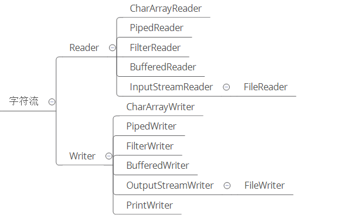
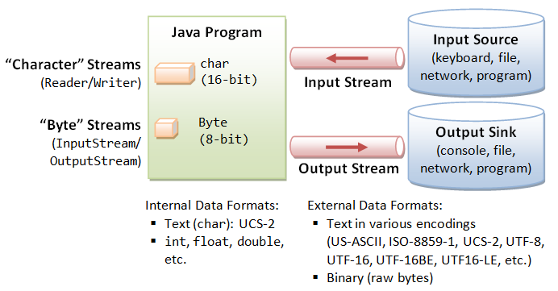
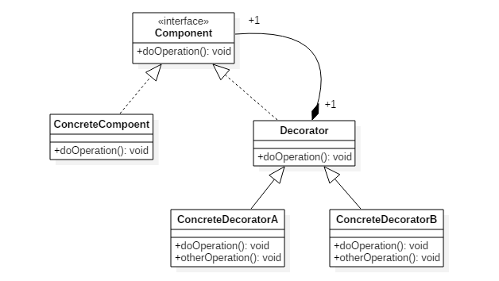
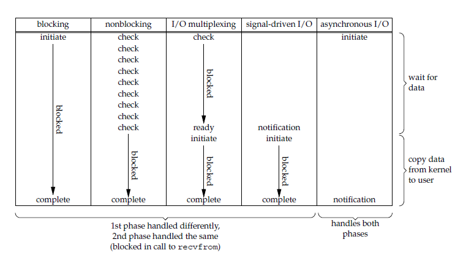
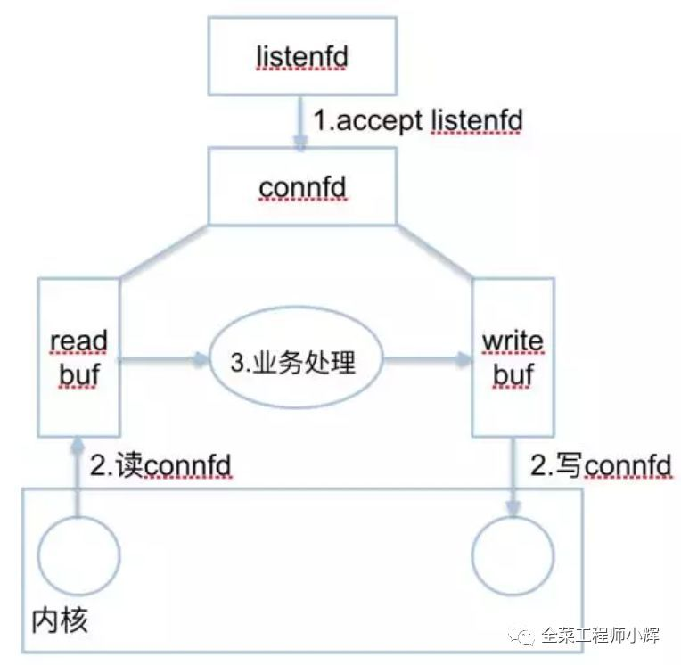
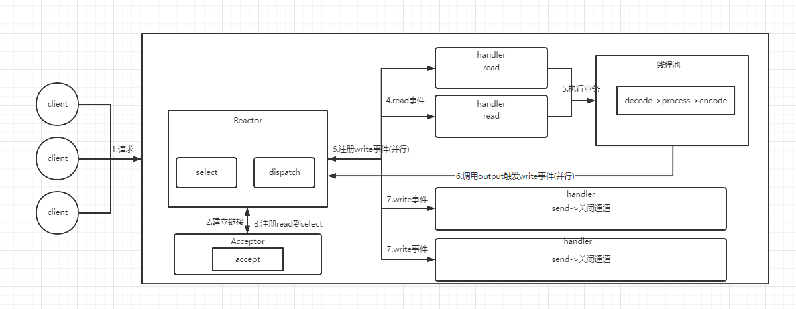
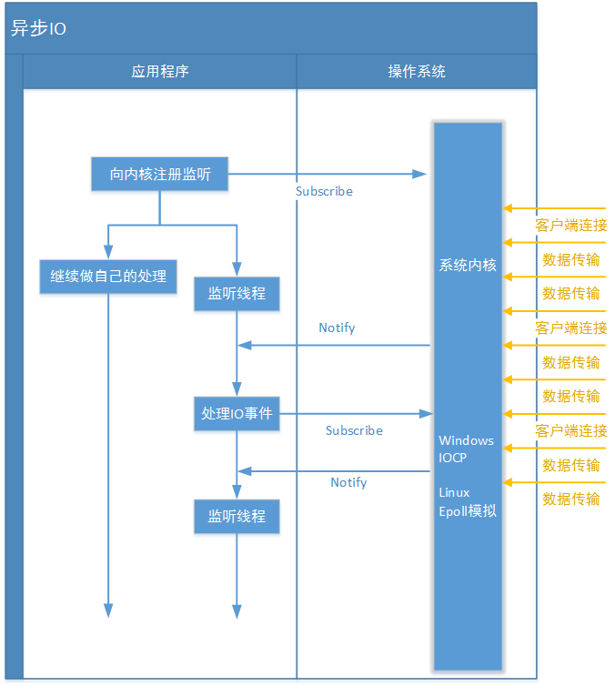

# 第四章 I/O框架

## 1. 基础io

### 1.1 io类型

#### 1.1.1 从传输方式上分为字节流和字符流




**字节流和字符流的区别**

字节流读取单个字节，字符流读取单个字符(一个字符根据编码的不同，对应的字节也不同，如 UTF-8 编码是 3 个字节，中文编码是 2 个字节。)

字节流用来处理二进制文件(图片、MP3、视频文件)，字符流用来处理文本文件(可以看做是特殊的二进制文件，使用了某种编码，人可以阅读)。

#### 1.1.2 字符转字节

Input/OutputStreamReader/Writer

编码就是把字符转换为字节，而解码是把字节重新组合成字符。

如果编码和解码过程使用不同的编码方式那么就出现了乱码。

- GBK 编码中，中文字符占 2 个字节，英文字符占 1 个字节；
- UTF-8 编码中，中文字符占 3 个字节，英文字符占 1 个字节；
- UTF-16be 编码中，中文字符和英文字符都占 2 个字节。



#### 1.1.3 从数据操作上分


## 1.2 io的设计模式

装饰者(Decorator)和具体组件(ConcreteComponent)都继承自组件(Component)，具体组件的方法实现不需要依赖于其它对象，而装饰者组合了一个组件，这样它可以装饰其它装饰者或者具体组件。所谓装饰，就是把这个装饰者套在被装饰者之上，从而动态扩展被装饰者的功能。装饰者的方法有一部分是自己的，这属于它的功能，然后调用被装饰者的方法实现，从而也保留了被装饰者的功能。可以看到，具体组件应当是装饰层次的最低层，因为只有具体组件的方法实现不需要依赖于其它对象。



以 InputStream 为例，

- InputStream 是抽象组件；
- FileInputStream 是 InputStream 的子类，属于具体组件，提供了字节流的输入操作；
- FilterInputStream 属于抽象装饰者，装饰者用于装饰组件，为组件提供额外的功能。例如 BufferedInputStream 为 FileInputStream 提供缓存的功能。


```java
//实例化一个具有缓存功能的字节流对象时，只需要在 FileInputStream 对象上再套一层 BufferedInputStream 对象即可。
FileInputStream fileInputStream = new FileInputStream(filePath);
BufferedInputStream bufferedInputStream = new BufferedInputStream(fileInputStream);
```

## 1.3 常用io类

有以下几类

- 磁盘操作: File
- 字节操作: InputStream 和 OutputStream
- 字符操作: Reader 和 Writer
- 对象操作: Serializable
- 网络操作: Socket

相关代码如下

```java
//递归遍历目录文件
public static void listAllFiles(File dir) {
    if (dir == null || !dir.exists()) {
        return;
    }
    if (dir.isFile()) {
        System.out.println(dir.getName());
        return;
    }
    for (File file : dir.listFiles()) {
        listAllFiles(file);
    }
}
//字节操作
public static void copyFile(String src, String dist) throws IOException {
    FileInputStream in = new FileInputStream(src);
    FileOutputStream out = new FileOutputStream(dist);
    byte[] buffer = new byte[20 * 1024];
    // read() 最多读取 buffer.length 个字节
    // 返回的是实际读取的个数
    // 返回 -1 的时候表示读到 eof，即文件尾
    while (in.read(buffer, 0, buffer.length) != -1) {
        out.write(buffer);
    }
    in.close();
    out.close();
}
//字符操作
public static void readFileContent(String filePath) throws IOException {
    FileReader fileReader = new FileReader(filePath);
    BufferedReader bufferedReader = new BufferedReader(fileReader);
    String line;
    while ((line = bufferedReader.readLine()) != null) {
        System.out.println(line);
    }
    // 装饰者模式使得 BufferedReader 组合了一个 Reader 对象
    // 在调用 BufferedReader 的 close() 方法时会去调用 Reader 的 close() 方法
    // 因此只要一个 close() 调用即可
    bufferedReader.close();
}
//对象的序列化操作
/*
序列化就是将一个对象转换成字节序列，方便存储和传输。 序列化: ObjectOutputStream.writeObject() 反序列化: ObjectInputStream.readObject() 不会对静态变量进行序列化，因为序列化只是保存对象的状态，静态变量属于类的状态。
*/
//序列化的类需要实现 Serializable 接口，它只是一个标准，没有任何方法需要实现，但是如果不去实现它的话而进行序列化，会抛出异常。
//transient 关键字可以使一些属性不会被序列化。
public static void main(String[] args) throws IOException, ClassNotFoundException {
    A a1 = new A(123, "abc");
    String objectFile = "file/a1";
    ObjectOutputStream objectOutputStream = new ObjectOutputStream(new FileOutputStream(objectFile));
    objectOutputStream.writeObject(a1);
    objectOutputStream.close();
    
    ObjectInputStream objectInputStream = new ObjectInputStream(new FileInputStream(objectFile));
    A a2 = (A) objectInputStream.readObject();
    objectInputStream.close();
    System.out.println(a2);
}
private static class A implements Serializable {
    private int x;
    private String y;
    A(int x, String y) {
        this.x = x;
        this.y = y;
    }
    @Override
    public String toString() {
        return "x = " + x + "  " + "y = " + y;
    }
}
//网络操作
InetAddress.getByName(String host);
InetAddress.getByAddress(byte[] address);

public static void main(String[] args) throws IOException {
    URL url = new URL("http://www.baidu.com");
    /* 字节流 */
    InputStream is = url.openStream();
    /* 字符流 */
    InputStreamReader isr = new InputStreamReader(is, "utf-8");
    /* 提供缓存功能 */
    BufferedReader br = new BufferedReader(isr);
    String line;
    while ((line = br.readLine()) != null) {
        System.out.println(line);
    }
    br.close();
}

```

## 1.4 unix io模型

一个输入操作通常包括两个阶段:

- 等待数据准备好
- 从内核向进程复制数据

对于一个套接字上的输入操作，第一步通常涉及等待数据从网络中到达。当所等待分组到达时，它被复制到内核中的某个缓冲区。第二步就是把数据从内核缓冲区复制到应用进程缓冲区。

Unix 下有五种 I/O 模型:

- 阻塞式 I/O
- 非阻塞式 I/O
- I/O 复用(select 和 poll)
- 信号驱动式 I/O(SIGIO)
- 异步 I/O(AIO)

1. 阻塞式i/o

   应用进程被阻塞，直到数据复制到应用进程缓冲区中才返回。

   应该注意到，在阻塞的过程中，其它程序还可以执行，因此阻塞不意味着整个操作系统都被阻塞。因为其他程序还可以执行，因此不消耗 CPU 时间，这种模型的执行效率会比较高。

   

   

   

2. 非阻塞式 I/O

   应用进程执行系统调用之后，内核返回一个错误码。应用进程可以继续执行，但是需要不断的执行系统调用来获知 I/O 是否完成，这种方式称为轮询(polling)。

   由于 CPU 要处理更多的系统调用，因此这种模型是比较低效的。

   

   

3. I/O 复用(select 和 poll)

   使用 select 或者 poll 等待数据，并且可以等待多个套接字中的任何一个变为可读，这一过程会被阻塞，当某一个套接字可读时返回。之后再使用 recvfrom 把数据从内核复制到进程中。

   它可以让单个进程具有处理多个 I/O 事件的能力。又被称为 Event Driven I/O，即事件驱动 I/O。

   如果一个 Web 服务器没有 I/O 复用，那么每一个 Socket 连接都需要创建一个线程去处理。如果同时有几万个连接，那么就需要创建相同数量的线程。并且相比于多进程和多线程技术，I/O 复用不需要进程线程创建和切换的开销，系统开销更小。

   

   

   

4. 信号驱动IO

   应用进程使用 sigaction 系统调用，内核立即返回，应用进程可以继续执行，也就是说等待数据阶段应用进程是非阻塞的。内核在数据到达时向应用进程发送 SIGIO 信号，应用进程收到之后在信号处理程序中调用 recvfrom 将数据从内核复制到应用进程中。

   相比于非阻塞式 I/O 的轮询方式，信号驱动 I/O 的 CPU 利用率更高。

   

   

   

5. 异步IO

   进行 aio_read 系统调用会立即返回，应用进程继续执行，不会被阻塞，内核会在所有操作完成之后向应用进程发送信号。

   异步 I/O 与信号驱动 I/O 的区别在于，异步 I/O 的信号是通知应用进程 I/O 完成，而信号驱动 I/O 的信号是通知应用进程可以开始 I/O。

   

   


**io模型比较**

- 同步 I/O: 应用进程在调用 recvfrom 操作时会阻塞。
- 异步 I/O: 不会阻塞。

阻塞式 I/O、非阻塞式 I/O、I/O 复用和信号驱动 I/O 都是同步 I/O，虽然非阻塞式 I/O 和信号驱动 I/O 在等待数据阶段不会阻塞，但是在之后的将数据从内核复制到应用进程这个操作会阻塞。



**注 IO多路复用是重点**

## 1.5 传统BIO详解

BIO就是: blocking IO。最容易理解、最容易实现的IO工作方式，应用程序向操作系统请求网络IO操作，这时应用程序会一直等待；另一方面，操作系统收到请求后，也会等待，直到网络上有数据传到监听端口；操作系统在收集数据后，会把数据发送给应用程序；最后应用程序受到数据，并解除等待状态。

### 1.5.1 重要概念

**阻塞IO**和**非阻塞IO**

这两个概念是`程序级别`的。主要描述的是程序请求操作系统IO操作后，如果IO资源没有准备好，那么程序该如何处理的问题: 前者等待；后者继续执行(并且使用线程一直轮询，直到有IO资源准备好了)

**同步IO**和**非同步IO**

这两个概念是`操作系统级别`的。主要描述的是操作系统在收到程序请求IO操作后，如果IO资源没有准备好，该如何响应程序的问题: 前者不响应，直到IO资源准备好以后；后者返回一个标记(好让程序和自己知道以后的数据往哪里通知)，当IO资源准备好以后，再用事件机制返回给程序。

### 1.5.2 传统BIO通信方式

以前大多数网络通信方式都是阻塞模式的，即:

- 客户端向服务器端发出请求后，客户端会一直等待(不会再做其他事情)，直到服务器端返回结果或者网络出现问题。
- 服务器端同样的，当在处理某个客户端A发来的请求时，另一个客户端B发来的请求会等待，直到服务器端的这个处理线程完成上一个处理。


问题:

+ 同一时间，服务器只能接受来自于客户端A的请求信息；虽然客户端A和客户端B的请求是同时进行的，但客户端B发送的请求信息只能等到服务器接受完A的请求数据后，才能被接受。

+ 由于服务器一次只能处理一个客户端请求，当处理完成并返回后(或者异常时)，才能进行第二次请求的处理。很显然，这样的处理方式在高并发的情况下，是不能采用的

### 1.5.3 多线程方式BIO

上面说的情况是服务器只有一个线程的情况，那么读者会直接提出我们可以使用多线程技术来解决这个问题:

- 当服务器收到客户端X的请求后，(读取到所有请求数据后)将这个请求送入一个独立线程进行处理，然后主线程继续接受客户端Y的请求。
- 客户端一侧，也可以使用一个子线程和服务器端进行通信。这样客户端主线程的其他工作就不受影响了，当服务器端有响应信息的时候再由这个子线程通过 监听模式/观察模式(等其他设计模式)通知主线程。


局限性:

+ 虽然在服务器端，请求的处理交给了一个独立线程进行，但是操作系统通知accept()的方式还是单个的。也就是，实际上是服务器接收到数据报文后的“业务处理过程”可以多线程，但是数据报文的接受还是需要一个一个的来(下文的示例代码和debug过程我们可以明确看到这一点)

+ 在linux系统中，可以创建的线程是有限的。我们可以通过cat /proc/sys/kernel/threads-max 命令查看可以创建的最大线程数。当然这个值是可以更改的，但是线程越多，CPU切换所需的时间也就越长，用来处理真正业务的需求也就越少。

+ 创建一个线程是有较大的资源消耗的。JVM创建一个线程的时候，即使这个线程不做任何的工作，JVM都会分配一个堆栈空间。这个空间的大小默认为128K，您可以通过-Xss参数进行调整。当然您还可以使用ThreadPoolExecutor线程池来缓解线程的创建问题，但是又会造成BlockingQueue积压任务的持续增加，同样消耗了大量资源。

+ 另外，如果您的应用程序大量使用长连接的话，线程是不会关闭的。这样系统资源的消耗更容易失控。 那么，如果你真想单纯使用线程解决阻塞的问题，那么您自己都可以算出来您一个服务器节点可以一次接受多大的并发了。看来，单纯使用线程解决这个问题不是最好的办法。

### 1.5.4 BIO通信方式问题

BIO的问题关键不在于是否使用了多线程(包括线程池)处理这次请求，而在于accept()、read()的操作点都是被阻塞。造成io过程变为串行操作效率低下

那么重点的问题并不是“是否使用了多线程”，而是为什么accept()、read()方法会被阻塞。即: 异步IO模式 就是为了解决这样的并发性存在的。但是为了说清楚异步IO模式，在介绍IO模式的时候，我们就要首先了解清楚，什么是 阻塞式同步、非阻塞式同步、多路复用同步模式。

API文档中对于 serverSocket.accept() 方法的使用描述:

> Listens for a connection to be made to this socket and accepts it. The method blocks until a connection is made.

阻塞式同步IO的工作原理:

- 服务器线程发起一个accept动作，询问操作系统 是否有新的socket套接字信息从端口X发送过来。

+ 注意，是询问操作系统。也就是说socket套接字的IO模式支持是基于操作系统的，那么自然同步IO/异步IO的支持就是需要操作系统级别的了。

如果操作系统没有发现有套接字从指定的端口X来，那么操作系统就会等待。这样serverSocket.accept()方法就会一直等待。这就是为什么accept()方法为什么会阻塞: 它内部的实现是使用的操作系统级别的同步IO。

## 1.6 NIO基础

Standard IO是对字节流的读写，在进行IO之前，首先创建一个流对象，流对象进行读写操作都是按字节 ，一个字节一个字节的来读或写。而NIO把IO抽象成块，类似磁盘的读写，每次IO操作的单位都是一个块，块被读入内存之后就是一个byte[]，NIO一次可以读或写多个字节。

+ **流与块**

  I/O 与 NIO 最重要的区别是数据打包和传输的方式，I/O 以流的方式处理数据，而 NIO 以块的方式处理数据。

  面向流的 I/O 一次处理一个字节数据: 一个输入流产生一个字节数据，一个输出流消费一个字节数据。为流式数据创建过滤器非常容易，链接几个过滤器，以便每个过滤器只负责复杂处理机制的一部分。不利的一面是，面向流的 I/O 通常相当慢。

  面向块的 I/O 一次处理一个数据块，按块处理数据比按流处理数据要快得多。但是面向块的 I/O 缺少一些面向流的 I/O 所具有的优雅性和简单性。

  I/O 包和 NIO 已经很好地集成了，java.io.* 已经以 NIO 为基础重新实现了，所以现在它可以利用 NIO 的一些特性。例如，java.io.* 包中的一些类包含以块的形式读写数据的方法，这使得即使在面向流的系统中，处理速度也会更快

+ **通道和缓冲区**

  1. 通道

     通道 Channel 是对原 I/O 包中的流的模拟，可以通过它读取和写入数据。

     通道与流的不同之处在于，流只能在一个方向上移动(一个流必须是 InputStream 或者 OutputStream 的子类)，而通道是双向的，可以用于读、写或者同时用于读写。

     通道包括以下类型:

     + FileChannel: 从文件中读写数据；
     + DatagramChannel: 通过 UDP 读写网络中数据；
     + SocketChannel: 通过 TCP 读写网络中数据；
     + ServerSocketChannel: 可以监听新进来的 TCP 连接，对每一个新进来的连接都会创建一个 SocketChannel。

  2. 缓冲区

     发送给一个通道的所有数据都必须首先放到缓冲区中，同样地，从通道中读取的任何数据都要先读到缓冲区中。也就是说，不会直接对通道进行读写数据，而是要先经过缓冲区。

     缓冲区实质上是一个数组，但它不仅仅是一个数组。缓冲区提供了对数据的结构化访问，而且还可以跟踪系统的读/写进程。

     缓冲区包括以下类型:

     - ByteBuffer
     - CharBuffer
     - ShortBuffer
     - IntBuffer
     - LongBuffer
     - FloatBuffer
     - DoubleBuffer

     **缓冲区状态变量**

     - capacity: 最大容量；
     - position: 当前已经读写的字节数；
     - limit: 还可以读写的字节数。

     状态变量的改变过程举例:

     ① 新建一个大小为 8 个字节的缓冲区，此时 position 为 0，而 limit = capacity = 8。capacity 变量不会改变，下面的讨论会忽略它。

     

     ② 从输入通道中读取 5 个字节数据写入缓冲区中，此时 position 移动设置为 5，limit 保持不变

     

     ③ 在将缓冲区的数据写到输出通道之前，需要先调用 flip() 方法，这个方法将 limit 设置为当前 position，并将 position 设置为 0。

     

     ④ 从缓冲区中取 4 个字节到输出缓冲中，此时 position 设为 4。

     

     ⑤ 最后需要调用 clear() 方法来清空缓冲区，此时 position 和 limit 都被设置为最初位置。

     

     **NIO复制文件示例**

     ```java
     public static void fastCopy(String src, String dist) throws IOException {
     
         /* 获得源文件的输入字节流 */
         FileInputStream fin = new FileInputStream(src);
     
         /* 获取输入字节流的文件通道 */
         FileChannel fcin = fin.getChannel();
     
         /* 获取目标文件的输出字节流 */
         FileOutputStream fout = new FileOutputStream(dist);
     
         /* 获取输出字节流的通道 */
         FileChannel fcout = fout.getChannel();
     
         /* 为缓冲区分配 1024 个字节 */
         ByteBuffer buffer = ByteBuffer.allocateDirect(1024);
     
         while (true) {
     
             /* 从输入通道中读取数据到缓冲区中 */
             int r = fcin.read(buffer);
     
             /* read() 返回 -1 表示 EOF */
             if (r == -1) {
                 break;
             }
     
             /* 切换读写 */
             buffer.flip();
     
             /* 把缓冲区的内容写入输出文件中 */
             fcout.write(buffer);
             
             /* 清空缓冲区 */
             buffer.clear();
         }
     }
     ```

     

+ **选择器**

  NIO 常常被叫做非阻塞 IO，主要是因为 NIO 在网络通信中的非阻塞特性被广泛使用。

  NIO 实现了 IO 多路复用中的 Reactor 模型，一个线程 Thread 使用一个选择器 Selector 通过轮询的方式去监听多个通道 Channel 上的事件，从而让一个线程就可以处理多个事件。

  通过配置监听的通道 Channel 为非阻塞，那么当 Channel 上的 IO 事件还未到达时，就不会进入阻塞状态一直等待，而是继续轮询其它 Channel，找到 IO 事件已经到达的 Channel 执行。

  因为创建和切换线程的开销很大，因此使用一个线程来处理多个事件而不是一个线程处理一个事件具有更好的性能。

  应该注意的是，只有套接字 Channel 才能配置为非阻塞，而 FileChannel 不能，为 FileChannel 配置非阻塞也没有意义。

  

  ```java
  //创建选择器
  Selector selector = Selector.open();
  //通道注册选择器
  ServerSocketChannel ssChannel = ServerSocketChannel.open();
  ssChannel.configureBlocking(false);
  ssChannel.register(selector, SelectionKey.OP_ACCEPT);
  //监听事件
  //使用 select() 来监听到达的事件，它会一直阻塞直到有至少一个事件到达。
  int num = selector.select();
  //获取到达的事件
  Set<SelectionKey> keys = selector.selectedKeys();
  Iterator<SelectionKey> keyIterator = keys.iterator();
  while (keyIterator.hasNext()) {
      SelectionKey key = keyIterator.next();
      if (key.isAcceptable()) {
          // ...
      } else if (key.isReadable()) {
          // ...
      }
      keyIterator.remove();
  }
  //事件循环
  //因为一次 select() 调用不能处理完所有的事件，并且服务器端有可能需要一直监听事件，因此服务器端处理事件的代码一般会放在一个死循环内。
  while (true) {
      int num = selector.select();
      Set<SelectionKey> keys = selector.selectedKeys();
      Iterator<SelectionKey> keyIterator = keys.iterator();
      while (keyIterator.hasNext()) {
          SelectionKey key = keyIterator.next();
          if (key.isAcceptable()) {
              // ...
          } else if (key.isReadable()) {
              // ...
          }
          keyIterator.remove();
      }
  }
  
  ```

  通道必须配置为非阻塞模式，否则使用选择器就没有任何意义了，因为如果通道在某个事件上被阻塞，那么服务器就不能响应其它事件，必须等待这个事件处理完毕才能去处理其它事件，显然这和选择器的作用背道而驰。

  在将通道注册到选择器上时，还需要指定要注册的具体事件，主要有以下几类:

  - SelectionKey.OP_CONNECT
  - SelectionKey.OP_ACCEPT
  - SelectionKey.OP_READ
  - SelectionKey.OP_WRITE

  **套接字NIO示例**

  ```java
  public class NIOServer {
  
      public static void main(String[] args) throws IOException {
          Selector selector = Selector.open();
          ServerSocketChannel ssChannel = ServerSocketChannel.open();
          ssChannel.configureBlocking(false);
          ssChannel.register(selector, SelectionKey.OP_ACCEPT);
          ServerSocket serverSocket = ssChannel.socket();
          InetSocketAddress address = new InetSocketAddress("127.0.0.1", 8888);
          serverSocket.bind(address);
          while (true) {
              selector.select();
              Set<SelectionKey> keys = selector.selectedKeys();
              Iterator<SelectionKey> keyIterator = keys.iterator();
  
              while (keyIterator.hasNext()) {
  
                  SelectionKey key = keyIterator.next();
  
                  if (key.isAcceptable()) {
  
                      ServerSocketChannel ssChannel1 = (ServerSocketChannel) key.channel();
  
                      // 服务器会为每个新连接创建一个 SocketChannel
                      SocketChannel sChannel = ssChannel1.accept();
                      sChannel.configureBlocking(false);
  
                      // 这个新连接主要用于从客户端读取数据
                      sChannel.register(selector, SelectionKey.OP_READ);
  
                  } else if (key.isReadable()) {
  
                      SocketChannel sChannel = (SocketChannel) key.channel();
                      System.out.println(readDataFromSocketChannel(sChannel));
                      sChannel.close();
                  }
  
                  keyIterator.remove();
              }
          }
      }
  
      private static String readDataFromSocketChannel(SocketChannel sChannel) throws IOException {
  
          ByteBuffer buffer = ByteBuffer.allocate(1024);
          StringBuilder data = new StringBuilder();
  
          while (true) {
  
              buffer.clear();
              int n = sChannel.read(buffer);
              if (n == -1) {
                  break;
              }
              buffer.flip();
              int limit = buffer.limit();
              char[] dst = new char[limit];
              for (int i = 0; i < limit; i++) {
                  dst[i] = (char) buffer.get(i);
              }
              data.append(dst);
              buffer.clear();
          }
          return data.toString();
      }
  }
  public class NIOClient {
      public static void main(String[] args) throws IOException {
          Socket socket = new Socket("127.0.0.1", 8888);
          OutputStream out = socket.getOutputStream();
          String s = "hello world";
          out.write(s.getBytes());
          out.close();
      }
  }
  
  ```

  **NIO和BIO对比**

  - NIO 是非阻塞的
  - NIO 面向块，I/O 面向流

  个人感悟:

  BIO单线程->等待链接(阻塞)->建立链接->接受信息(阻塞)->处理数据->返回数据(阻塞)->处理完成->等待链接(阻塞)

  BIO多线程->等待链接(阻塞)->建立链接->接受信息(阻塞)->处理数据->返回数据(阻塞)->处理完成->等待链接(阻塞)

  ​                                   线程2->建立链接->接受信息(阻塞)->处理数据->返回数据(阻塞)->处理完成->线程关闭(归还线程池)

  NIO->等待链接(阻塞)->建立链接->注册到selector等待后续信息

  ​                        线程2->接受信息(阻塞)->处理数据(线程池)->返回数据
  
  
  
  BIO需要开辟多个线程各自建立链接后接受信息中间需要阻塞线程,造成资源浪费,效率很低
  
  NIO可以使用selector线程**轮询**监控多个链接(接受链接和各种其他事件)节省了多线程的资源,通过**事件驱动**的方式节省了BIO中等待数据的阻塞时间
  
  IO复用主要优势在高并发场景,后文要讲的reactor框架就是基于io多路复用(节省系统资源)+池化技术

## 1.7  NIO-IO多路复用详解

**服务端io线程模型**



**2种fd**(注释:file descriptor 文件描述符号，类似文件句柄)

1. listenfd：一般情况，只有一个。用来监听一个特定的端口(如80)。
2. connfd：每个连接都有一个connfd。用来收发数据。

**3种事件**

1. listenfd进行accept阻塞监听，创建一个connfd
2. 用户态/内核态copy数据。每个connfd对应着2个应用缓冲区：readbuf和writebuf。
3. 处理connfd发来的数据。业务逻辑处理，准备response到writebuf。

### 1.7.1 多路复用实现类型

目前流程的多路复用IO实现主要包括四种: `select`、`poll`、`epoll`、`kqueue`。下表是他们的一些重要特性的比较:

| IO模型 | 相对性能 | 关键思路         | 操作系统      | JAVA支持情况                                                 |
| ------ | -------- | ---------------- | ------------- | ------------------------------------------------------------ |
| select | 较高     | Reactor          | windows/Linux | 支持,Reactor模式(反应器设计模式)。Linux操作系统的 kernels 2.4内核版本之前，默认使用select；而目前windows下对同步IO的支持，都是select模型 |
| poll   | 较高     | Reactor          | Linux         | Linux下的JAVA NIO框架，Linux kernels 2.6内核版本之前使用poll进行支持。也是使用的Reactor模式 |
| epoll  | 高       | Reactor/Proactor | Linux         | Linux kernels 2.6内核版本及以后使用epoll进行支持；Linux kernels 2.6内核版本之前使用poll进行支持；另外一定注意，由于Linux下没有Windows下的IOCP技术提供真正的 异步IO 支持，所以Linux下使用epoll模拟异步IO |
| kqueue | 高       | Proactor         | Linux         | 目前JAVA的版本不支持                                         |

多路复用IO技术最适用的是“高并发”场景，所谓高并发是指1毫秒内至少同时有上千个连接请求准备好。其他情况下多路复用IO技术发挥不出来它的优势。另一方面，使用JAVA NIO进行功能实现，相对于传统的Socket套接字实现要复杂一些，所以实际应用中，需要根据自己的业务需求进行技术选择。

### 1.7.2 传统IO模型

对于传统IO模型，其主要是一个Server对接N个客户端，在客户端连接之后，为每个客户端都分配一个执行线程。


从图中可以看出，传统IO的特点在于：

- 每个客户端连接到达之后，服务端会分配一个线程给该客户端，该线程会处理包括读取数据，解码，业务计算，编码，以及发送数据整个过程；
- 同一时刻，服务端的吞吐量与服务器所提供的线程数量是呈线性关系的。

这种设计模式在客户端连接不多，并发量不大的情况下是可以运行得很好的，但是在海量并发的情况下，这种模式就显得力不从心了。这种模式主要存在的问题有如下几点：

- 服务器的并发量对服务端能够创建的线程数有很大的依赖关系，但是服务器线程却是不能无限增长的；
- 服务端每个线程不仅要进行IO读写操作，而且还需要进行业务计算；
- 服务端在获取客户端连接，读取数据，以及写入数据的过程都是阻塞类型的，在网络状况不好的情况下，这将极大的降低服务器每个线程的利用率，从而降低服务器吞吐量。

### 1.7.3 Reactor事件驱动模型

在传统IO模型中，由于线程在等待连接以及进行IO操作时都会阻塞当前线程，这部分损耗是非常大的。因而jdk 1.4中就提供了一套非阻塞IO的API。该API本质上是以事件驱动来处理网络事件的，而Reactor是基于该API提出的一套IO模型。如下是Reactor事件驱动模型的示意图：


从图中可以看出，在Reactor模型中，主要有四个角色：客户端连接，Reactor，Acceptor和Handler。这里Acceptor会不断地接收客户端的连接，然后将接收到的连接交由Reactor进行分发，最后有具体的Handler进行处理。改进后的Reactor模型相对于传统的IO模型主要有如下优点：

- 从模型上来讲，如果仅仅还是只使用一个线程池来处理客户端连接的网络读写，以及业务计算，那么Reactor模型与传统IO模型在效率上并没有什么提升。但是Reactor模型是以事件进行驱动的，其能够将接收客户端连接，+ 网络读和网络写，以及业务计算进行拆分，从而极大的提升处理效率；
- Reactor模型是异步非阻塞模型，工作线程在没有网络事件时可以处理其他的任务，而不用像传统IO那样必须阻塞等待。


### 1.7.4 Reactor模型----业务处理与IO分离

在上面的Reactor模型中，由于网络读写和业务操作都在同一个线程中，在高并发情况下，这里的系统瓶颈主要在两方面：

- 高频率的网络读写事件处理；
- 大量的业务操作处理；

基于上述两个问题，这里在单线程Reactor模型的基础上提出了使用线程池的方式处理业务操作的模型。



从图中可以看出，在多线程进行业务操作的模型下，该模式主要具有如下特点：

- 使用一个线程进行客户端连接的接收以及网络读写事件的处理；
- 在接收到客户端连接之后，将该连接交由线程池进行数据的编解码以及业务计算。

这种模式相较于前面的模式性能有了很大的提升，主要在于在进行网络读写的同时，也进行了业务计算，从而大大提升了系统的吞吐量。但是这种模式也有其不足，主要在于：

- 网络读写是一个比较消耗CPU的操作，在高并发的情况下，将会有大量的客户端数据需要进行网络读写，此时一个线程将不足以处理这么多请求。

### 1.7.5 Reactor模型----并发读写

对于使用线程池处理业务操作的模型，由于网络读写在高并发情况下会成为系统的一个瓶颈，因而针对该模型这里提出了一种改进后的模型，即使用线程池进行网络读写，而仅仅只使用一个线程专门接收客户端连接。如下是该模型的示意图：


可以看到，改进后的Reactor模型将Reactor拆分为了mainReactor(Accept)和subReactor(Handler)。这里mainReactor主要进行客户端连接的处理，处理完成之后将该连接交由subReactor以处理客户端的网络读写。这里的subReactor则是使用一个线程池来支撑的，其读写能力将会随着线程数的增多而大大增加。对于业务操作，这里也是使用一个线程池，而每个业务请求都只需要进行编解码和业务计算。通过这种方式，服务器的性能将会大大提升，在可见情况下，其基本上可以支持百万连接

### 1.7.6 Reactor模型示例

```java
public class Reactor implements Runnable {
  private final Selector selector;
  private final ServerSocketChannel serverSocket;

  public Reactor(int port) throws IOException {
    serverSocket = ServerSocketChannel.open();  // 创建服务端的ServerSocketChannel
    serverSocket.configureBlocking(false);  // 设置为非阻塞模式
    selector = Selector.open();  // 创建一个Selector多路复用器
    SelectionKey key = serverSocket.register(selector, SelectionKey.OP_ACCEPT);
    serverSocket.bind(new InetSocketAddress(port));  // 绑定服务端端口
    key.attach(new Acceptor(serverSocket));  // 为服务端Channel绑定一个Acceptor
  }

  @Override
  public void run() {
    try {
      while (!Thread.interrupted()) {
        selector.select();  // 服务端使用一个线程不断等待客户端的连接到达
        Set<SelectionKey> keys = selector.selectedKeys();
        Iterator<SelectionKey> iterator = keys.iterator();
        while (iterator.hasNext()) {
          dispatch(iterator.next());  // 监听到客户端连接事件后将其分发给Acceptor
          iterator.remove();
        }

        selector.selectNow();
      }
    } catch (IOException e) {
      e.printStackTrace();
    }
  }
  private void dispatch(SelectionKey key) throws IOException {
    // 这里的attachement也即前面为服务端Channel绑定的Acceptor，调用其run()方法进行
    // 客户端连接的获取，并且进行分发
    Runnable attachment = (Runnable) key.attachment();
    attachment.run();
  }
}
public class Acceptor implements Runnable {
  private final ExecutorService executor = Executors.newFixedThreadPool(20);

  private final ServerSocketChannel serverSocket;

  public Acceptor(ServerSocketChannel serverSocket) {
    this.serverSocket = serverSocket;
  }

  @Override
  public void run() {
    try {
      SocketChannel channel = serverSocket.accept();  // 获取客户端连接
      if (null != channel) {
        executor.execute(new Handler(channel));  // 将客户端连接交由线程池处理
      }
    } catch (IOException e) {
      e.printStackTrace();
    }
  }
}
//在Handler中，主要进行的就是为每一个客户端Channel创建一个Selector，并且监听该Channel的网络读写事件。当有事件到达时，进行数据的读写，而业务操作这交由具体的业务线程池处理。
public class Handler implements Runnable {
  private volatile static Selector selector;
  private final SocketChannel channel;
  private SelectionKey key;
  private volatile ByteBuffer input = ByteBuffer.allocate(1024);
  private volatile ByteBuffer output = ByteBuffer.allocate(1024);

  public Handler(SocketChannel channel) throws IOException {
    this.channel = channel;
    channel.configureBlocking(false);  // 设置客户端连接为非阻塞模式
    selector = Selector.open();  // 为客户端创建一个新的多路复用器
    key = channel.register(selector, SelectionKey.OP_READ);  // 注册客户端Channel的读事件
  }

  @Override
  public void run() {
    try {
      while (selector.isOpen() && channel.isOpen()) {
        Set<SelectionKey> keys = select();  // 等待客户端事件发生
        Iterator<SelectionKey> iterator = keys.iterator();
        while (iterator.hasNext()) {
          SelectionKey key = iterator.next();
          iterator.remove();

          // 如果当前是读事件，则读取数据
          if (key.isReadable()) {
            read(key);
          } else if (key.isWritable()) {
           // 如果当前是写事件，则写入数据
            write(key);
          }
        }
      }
    } catch (Exception e) {
      e.printStackTrace();
    }
  }

  // 这里处理的主要目的是处理Jdk的一个bug，该bug会导致Selector被意外触发，但是实际上没有任何事件到达，
  // 此时的处理方式是新建一个Selector，然后重新将当前Channel注册到该Selector上
  private Set<SelectionKey> select() throws IOException {
    selector.select();
    Set<SelectionKey> keys = selector.selectedKeys();
    if (keys.isEmpty()) {
      int interestOps = key.interestOps();
      selector = Selector.open();
      key = channel.register(selector, interestOps);
      return select();
    }

    return keys;
  }

  // 读取客户端发送的数据
  private void read(SelectionKey key) throws IOException {
    channel.read(input);
    if (input.position() == 0) {
      return;
    }

    input.flip();
    process();  // 对读取的数据进行业务处理
    input.clear();
    key.interestOps(SelectionKey.OP_WRITE);  // 读取完成后监听写入事件
  }

  private void write(SelectionKey key) throws IOException {
    output.flip();
    if (channel.isOpen()) {
      channel.write(output);  // 当有写入事件时，将业务处理的结果写入到客户端Channel中
      key.channel();
      channel.close();
      output.clear();
    }
  }
    
  // 进行业务处理，并且获取处理结果。本质上，基于Reactor模型，如果这里成为处理瓶颈，
  // 则直接将其处理过程放入线程池即可，并且使用一个Future获取处理结果，最后写入客户端Channel
  private void process() {
    byte[] bytes = new byte[input.remaining()];
    input.get(bytes);
    String message = new String(bytes, CharsetUtil.UTF_8);
    System.out.println("receive message from client: \n" + message);

    output.put("hello client".getBytes());
  }
}

```


### 1.7.7 java对多路复用IO的支持


### 1.7.8 重要概念Channel

通道，被建立的一个应用程序和操作系统交互事件、传递内容的渠道(注意是连接到操作系统)。一个通道会有一个专属的文件状态描述符。那么既然是和操作系统进行内容的传递，那么说明应用程序可以通过通道读取数据，也可以通过通道向操作系统写数据。


所有被Selector(选择器)注册的通道，只能是继承了SelectableChannel类的子类。如上图所示

- ServerSocketChannel: 应用服务器程序的监听通道。只有通过这个通道，应用程序才能向操作系统注册支持“多路复用IO”的端口监听。同时支持UDP协议和TCP协议。
- ScoketChannel: TCP Socket套接字的监听通道，一个Socket套接字对应了一个客户端IP: 端口 到 服务器IP: 端口的通信连接。
- DatagramChannel: UDP 数据报文的监听通道。

### 1.7.9 重要概念: Buffer

数据缓存区: 在JAVA NIO 框架中，为了保证每个通道的数据读写速度JAVA NIO 框架为每一种需要支持数据读写的通道集成了Buffer的支持。

这句话怎么理解呢? 例如ServerSocketChannel通道它只支持对OP_ACCEPT事件的监听，所以它是不能直接进行网络数据内容的读写的。所以ServerSocketChannel是没有集成Buffer的。

Buffer有两种工作模式: 写模式和读模式。在读模式下，应用程序只能从Buffer中读取数据，不能进行写操作。但是在写模式下，应用程序是可以进行读操作的，这就表示可能会出现脏读的情况。所以一旦您决定要从Buffer中读取数据，一定要将Buffer的状态改为读模式。


+ position: 缓存区目前这在操作的数据块位置

+ limit: 缓存区最大可以进行操作的位置。缓存区的读写状态正式由这个属性控制的。

+ capacity: 缓存区的最大容量。这个容量是在缓存区创建时进行指定的。由于高并发时通道数量往往会很庞大，所以每一个缓存区的容量最好不要过大。

### 1.7.9 重要概念:selector

Selector的英文含义是“选择器”，不过根据我们详细介绍的Selector的岗位职责，您可以把它称之为“轮询代理器”、“事件订阅器”、“channel容器管理机”都行。

- 事件订阅和Channel管理

应用程序将向Selector对象注册需要它关注的Channel，以及具体的某一个Channel会对哪些IO事件感兴趣。Selector中也会维护一个“已经注册的Channel”的容器。以下代码来自WindowsSelectorImpl实现类中，对已经注册的Channel的管理容器:

```java
// Initial capacity of the poll array
private final int INIT_CAP = 8;
// Maximum number of sockets for select().
// Should be INIT_CAP times a power of 2
private final static int MAX_SELECTABLE_FDS = 1024;

// The list of SelectableChannels serviced by this Selector. Every mod
// MAX_SELECTABLE_FDS entry is bogus, to align this array with the poll
// array,  where the corresponding entry is occupied by the wakeupSocket
private SelectionKeyImpl[] channelArray = new SelectionKeyImpl[INIT_CAP];

```

- 轮询代理

应用层不再通过阻塞模式或者非阻塞模式直接询问操作系统“事件有没有发生”，而是由Selector代其询问。

- 实现不同操作系统的支持

之前已经提到过，多路复用IO技术 是需要操作系统进行支持的，其特点就是操作系统可以同时扫描同一个端口上不同网络连接的事件。所以作为上层的JVM，必须要为 不同操作系统的多路复用IO实现 编写不同的代码。同样我使用的测试环境是Windows，它对应的实现类是


### 1.7.10 JAVA NIO 框架简要设计分析

我们知道了多路复用IO技术是操作系统的内核实现。在不同的操作系统，甚至同一系列操作系统的版本中所实现的多路复用IO技术都是不一样的。那么作为跨平台的JAVA JVM来说如何适应多种多样的多路复用IO技术实现呢? 面向对象的威力就显现出来了: 无论使用哪种实现方式，他们都会有“选择器”、“通道”、“缓存”这几个操作要素，那么可以为不同的多路复用IO技术创建一个统一的抽象组，并且为不同的操作系统进行具体的实现。JAVA NIO中对各种多路复用IO的支持，主要的基础是java.nio.channels.spi.SelectorProvider抽象类，其中的几个主要抽象方法包括:

- public abstract DatagramChannel openDatagramChannel(): 创建和这个操作系统匹配的UDP 通道实现。
- public abstract AbstractSelector openSelector(): 创建和这个操作系统匹配的NIO选择器，就像上文所述，不同的操作系统，不同的版本所默认支持的NIO模型是不一样的。
- public abstract ServerSocketChannel openServerSocketChannel(): 创建和这个NIO模型匹配的服务器端通道。
- public abstract SocketChannel openSocketChannel(): 创建和这个NIO模型匹配的TCP Socket套接字通道(用来反映客户端的TCP连接)

由于JAVA NIO框架的整个设计是很大的，所以我们只能还原一部分我们关心的问题。这里我们以JAVA NIO框架中对于不同多路复用IO技术的选择器 进行实例化创建的方式作为例子，以点窥豹观全局:


很明显，不同的SelectorProvider实现对应了不同的 选择器。由具体的SelectorProvider实现进行创建。另外说明一下，实际上netty底层也是通过这个设计获得具体使用的NIO模型，我们后文讲解Netty时，会讲到这个问题。

### 1.7.11 javaNIO示例

```java
package testNSocket;

import java.net.InetSocketAddress;
import java.net.ServerSocket;
import java.net.URLDecoder;
import java.net.URLEncoder;
import java.nio.ByteBuffer;
import java.nio.channels.SelectableChannel;
import java.nio.channels.SelectionKey;
import java.nio.channels.Selector;
import java.nio.channels.ServerSocketChannel;
import java.nio.channels.SocketChannel;
import java.util.Iterator;

import org.apache.commons.logging.Log;
import org.apache.commons.logging.LogFactory;
import org.apache.log4j.BasicConfigurator;

public class SocketServer1 {

    static {
        BasicConfigurator.configure();
    }

    /**
     * 日志
     */
    private static final Log LOGGER = LogFactory.getLog(SocketServer1.class);

    public static void main(String[] args) throws Exception {
        ServerSocketChannel serverChannel = ServerSocketChannel.open();
        serverChannel.configureBlocking(false);
        ServerSocket serverSocket = serverChannel.socket();
        serverSocket.setReuseAddress(true);
        serverSocket.bind(new InetSocketAddress(83));

        Selector selector = Selector.open();
        //注意、服务器通道只能注册SelectionKey.OP_ACCEPT事件
        serverChannel.register(selector, SelectionKey.OP_ACCEPT);

        try {
            while(true) {
                //如果条件成立，说明本次询问selector，并没有获取到任何准备好的、感兴趣的事件
                //java程序对多路复用IO的支持也包括了阻塞模式 和非阻塞模式两种。
                if(selector.select(100) == 0) {
                    //================================================
                    //      这里视业务情况，可以做一些然并卵的事情
                    //================================================
                    continue;
                }
                //这里就是本次询问操作系统，所获取到的“所关心的事件”的事件类型(每一个通道都是独立的)
                Iterator<SelectionKey> selecionKeys = selector.selectedKeys().iterator();

                while(selecionKeys.hasNext()) {
                    SelectionKey readyKey = selecionKeys.next();
                    //这个已经处理的readyKey一定要移除。如果不移除，就会一直存在在selector.selectedKeys集合中
                    //待到下一次selector.select() > 0时，这个readyKey又会被处理一次
                    selecionKeys.remove();

                    SelectableChannel selectableChannel = readyKey.channel();
                    if(readyKey.isValid() && readyKey.isAcceptable()) {
                        SocketServer1.LOGGER.info("======channel通道已经准备好=======");
                        /*
                         * 当server socket channel通道已经准备好，就可以从server socket channel中获取socketchannel了
                         * 拿到socket channel后，要做的事情就是马上到selector注册这个socket channel感兴趣的事情。
                         * 否则无法监听到这个socket channel到达的数据
                         * */
                        ServerSocketChannel serverSocketChannel = (ServerSocketChannel)selectableChannel;
                        SocketChannel socketChannel = serverSocketChannel.accept();
                        registerSocketChannel(socketChannel , selector);

                    } else if(readyKey.isValid() && readyKey.isConnectable()) {
                        SocketServer1.LOGGER.info("======socket channel 建立连接=======");
                    } else if(readyKey.isValid() && readyKey.isReadable()) {
                        SocketServer1.LOGGER.info("======socket channel 数据准备完成，可以去读==读取=======");
                        readSocketChannel(readyKey);
                    }
                }
            }
        } catch(Exception e) {
            SocketServer1.LOGGER.error(e.getMessage() , e);
        } finally {
            serverSocket.close();
        }
    }

    /**
     * 在server socket channel接收到/准备好 一个新的 TCP连接后。
     * 就会向程序返回一个新的socketChannel。<br>
     * 但是这个新的socket channel并没有在selector“选择器/代理器”中注册，
     * 所以程序还没法通过selector通知这个socket channel的事件。
     * 于是我们拿到新的socket channel后，要做的第一个事情就是到selector“选择器/代理器”中注册这个
     * socket channel感兴趣的事件
     * @param socketChannel 新的socket channel
     * @param selector selector“选择器/代理器”
     * @throws Exception
     */
    private static void registerSocketChannel(SocketChannel socketChannel , Selector selector) throws Exception {
        socketChannel.configureBlocking(false);
        //socket通道可以且只可以注册三种事件SelectionKey.OP_READ | SelectionKey.OP_WRITE | SelectionKey.OP_CONNECT
        socketChannel.register(selector, SelectionKey.OP_READ , ByteBuffer.allocate(2048));
    }

    /**
     * 这个方法用于读取从客户端传来的信息。
     * 并且观察从客户端过来的socket channel在经过多次传输后，是否完成传输。
     * 如果传输完成，则返回一个true的标记。
     * @param socketChannel
     * @throws Exception
     */
    private static void readSocketChannel(SelectionKey readyKey) throws Exception {
        SocketChannel clientSocketChannel = (SocketChannel)readyKey.channel();
        //获取客户端使用的端口
        InetSocketAddress sourceSocketAddress = (InetSocketAddress)clientSocketChannel.getRemoteAddress();
        Integer resoucePort = sourceSocketAddress.getPort();

        //拿到这个socket channel使用的缓存区，准备读取数据
        //在后文，将详细讲解缓存区的用法概念，实际上重要的就是三个元素capacity,position和limit。
        ByteBuffer contextBytes = (ByteBuffer)readyKey.attachment();
        //将通道的数据写入到缓存区，注意是写入到缓存区。
        //由于之前设置了ByteBuffer的大小为2048 byte，所以可以存在写入不完的情况
        //没关系，我们后面来调整代码。这里我们暂时理解为一次接受可以完成
        int realLen = -1;
        try {
            realLen = clientSocketChannel.read(contextBytes);
        } catch(Exception e) {
            //这里抛出了异常，一般就是客户端因为某种原因终止了。所以关闭channel就行了
            SocketServer1.LOGGER.error(e.getMessage());
            clientSocketChannel.close();
            return;
        }

        //如果缓存区中没有任何数据(但实际上这个不太可能，否则就不会触发OP_READ事件了)
        if(realLen == -1) {
            SocketServer1.LOGGER.warn("====缓存区没有数据? ====");
            return;
        }

        //将缓存区从写状态切换为读状态(实际上这个方法是读写模式互切换)。
        //这是java nio框架中的这个socket channel的写请求将全部等待。
        contextBytes.flip();
        //注意中文乱码的问题，我个人喜好是使用URLDecoder/URLEncoder，进行解编码。
        //当然java nio框架本身也提供编解码方式，看个人咯
        byte[] messageBytes = contextBytes.array();
        String messageEncode = new String(messageBytes , "UTF-8");
        String message = URLDecoder.decode(messageEncode, "UTF-8");

        //如果收到了“over”关键字，才会清空buffer，并回发数据；
        //否则不清空缓存，还要还原buffer的“写状态”
        if(message.indexOf("over") != -1) {
            //清空已经读取的缓存，并从新切换为写状态(这里要注意clear()和capacity()两个方法的区别)
            contextBytes.clear();
            SocketServer1.LOGGER.info("端口:" + resoucePort + "客户端发来的信息======message : " + message);

            //======================================================
            //          当然接受完成后，可以在这里正式处理业务了        
            //======================================================

            //回发数据，并关闭channel
            ByteBuffer sendBuffer = ByteBuffer.wrap(URLEncoder.encode("回发处理结果", "UTF-8").getBytes());
            clientSocketChannel.write(sendBuffer);
            clientSocketChannel.close();
        } else {
            SocketServer1.LOGGER.info("端口:" + resoucePort + "客户端信息还未接受完，继续接受======message : " + message);
            //这是，limit和capacity的值一致，position的位置是realLen的位置
            contextBytes.position(realLen);
            contextBytes.limit(contextBytes.capacity());
        }
    }
}
```

代码中的注释是比较清楚的，但是还是要对几个关键点进行一下讲解:

- serverChannel.register(Selector sel, int ops, Object att): 实际上register(Selector sel, int ops, Object att)方法是ServerSocketChannel类的父类AbstractSelectableChannel提供的一个方法，表示只要继承了AbstractSelectableChannel类的子类都可以注册到选择器中。通过观察整个AbstractSelectableChannel继承关系，下图中的这些类可以被注册到选择器中:

  

- SelectionKey.OP_ACCEPT: 不同的Channel对象可以注册的“我关心的事件”是不一样的。例如ServerSocketChannel除了能够被允许关注OP_ACCEPT事件外，不允许再关心其他事件了(否则运行时会抛出异常)。以下梳理了常使用的AbstractSelectableChannel子类可以注册的事件列表:

  | 通道类              | 通道作用     | 可关注的事件                                                 |
  | ------------------- | ------------ | ------------------------------------------------------------ |
  | ServerSocketChannel | 服务器端通道 | SelectionKey.OP_ACCEPT                                       |
  | DatagramChannel     | UDP协议通道  | SelectionKey.OP_READ、SelectionKey.OP_WRITE                  |
  | SocketChannel       | TCP协议通道  | SelectionKey.OP_READ、SelectionKey.OP_WRITE、SelectionKey.OP_CONNECT |

- selector.selectedKeys().iterator(): 当选择器Selector收到操作系统的IO操作事件后，它的selectedKeys将在下一次轮询操作中，收到这些事件的关键描述字(不同的channel，就算关键字一样，也会存储成两个对象)。但是每一个“事件关键字”被处理后都必须移除，否则下一次轮询时，这个事件会被重复处理。

### 1.7.11 javaNIO示例改进

上面的代码中，我们为了讲解selector的使用，在缓存使用上就进行了简化。实际的应用中，为了节约内存资源，我们一般不会为一个通道分配那么多的缓存空间。下面的代码我们主要对其中的缓存操作进行了优化:

```java
package testNSocket;

import java.net.InetSocketAddress;
import java.net.ServerSocket;
import java.net.URLDecoder;
import java.net.URLEncoder;

import java.nio.ByteBuffer;
import java.nio.channels.SelectableChannel;
import java.nio.channels.SelectionKey;
import java.nio.channels.Selector;
import java.nio.channels.ServerSocketChannel;
import java.nio.channels.SocketChannel;

import java.util.Iterator;
import java.util.concurrent.ConcurrentHashMap;
import java.util.concurrent.ConcurrentMap;

import org.apache.commons.logging.Log;
import org.apache.commons.logging.LogFactory;
import org.apache.log4j.BasicConfigurator;

public class SocketServer2 {

    static {
        BasicConfigurator.configure();
    }

    /**
     * 日志
     */
    private static final Log LOGGER = LogFactory.getLog(SocketServer2.class);

    /**
     * 改进的java nio server的代码中，由于buffer的大小设置的比较小。
     * 我们不再把一个client通过socket channel多次传给服务器的信息保存在beff中了(因为根本存不下)<br>
     * 我们使用socketchanel的hashcode作为key(当然您也可以自己确定一个id)，信息的stringbuffer作为value，存储到服务器端的一个内存区域MESSAGEHASHCONTEXT。
     * 
     * 如果您不清楚ConcurrentHashMap的作用和工作原理，请自行百度/Google
     */
    private static final ConcurrentMap<Integer, StringBuffer> MESSAGEHASHCONTEXT = new ConcurrentHashMap<Integer , StringBuffer>();

    public static void main(String[] args) throws Exception {
        ServerSocketChannel serverChannel = ServerSocketChannel.open();
        serverChannel.configureBlocking(false);
        ServerSocket serverSocket = serverChannel.socket();
        serverSocket.setReuseAddress(true);
        serverSocket.bind(new InetSocketAddress(83));

        Selector selector = Selector.open();
        //注意、服务器通道只能注册SelectionKey.OP_ACCEPT事件
        serverChannel.register(selector, SelectionKey.OP_ACCEPT);

        try {
            while(true) {
                //如果条件成立，说明本次询问selector，并没有获取到任何准备好的、感兴趣的事件
                //java程序对多路复用IO的支持也包括了阻塞模式 和非阻塞模式两种。
                if(selector.select(100) == 0) {
                    //================================================
                    //      这里视业务情况，可以做一些然并卵的事情
                    //================================================
                    continue;
                }
                //这里就是本次询问操作系统，所获取到的“所关心的事件”的事件类型(每一个通道都是独立的)
                Iterator<SelectionKey> selecionKeys = selector.selectedKeys().iterator();

                while(selecionKeys.hasNext()) {
                    SelectionKey readyKey = selecionKeys.next();
                    //这个已经处理的readyKey一定要移除。如果不移除，就会一直存在在selector.selectedKeys集合中
                    //待到下一次selector.select() > 0时，这个readyKey又会被处理一次
                    selecionKeys.remove();

                    SelectableChannel selectableChannel = readyKey.channel();
                    if(readyKey.isValid() && readyKey.isAcceptable()) {
                        SocketServer2.LOGGER.info("======channel通道已经准备好=======");
                        /*
                         * 当server socket channel通道已经准备好，就可以从server socket channel中获取socketchannel了
                         * 拿到socket channel后，要做的事情就是马上到selector注册这个socket channel感兴趣的事情。
                         * 否则无法监听到这个socket channel到达的数据
                         * */
                        ServerSocketChannel serverSocketChannel = (ServerSocketChannel)selectableChannel;
                        SocketChannel socketChannel = serverSocketChannel.accept();
                        registerSocketChannel(socketChannel , selector);

                    } else if(readyKey.isValid() && readyKey.isConnectable()) {
                        SocketServer2.LOGGER.info("======socket channel 建立连接=======");
                    } else if(readyKey.isValid() && readyKey.isReadable()) {
                        SocketServer2.LOGGER.info("======socket channel 数据准备完成，可以去读==读取=======");
                        readSocketChannel(readyKey);
                    }
                }
            }
        } catch(Exception e) {
            SocketServer2.LOGGER.error(e.getMessage() , e);
        } finally {
            serverSocket.close();
        }
    }

    /**
     * 在server socket channel接收到/准备好 一个新的 TCP连接后。
     * 就会向程序返回一个新的socketChannel。<br>
     * 但是这个新的socket channel并没有在selector“选择器/代理器”中注册，
     * 所以程序还没法通过selector通知这个socket channel的事件。
     * 于是我们拿到新的socket channel后，要做的第一个事情就是到selector“选择器/代理器”中注册这个
     * socket channel感兴趣的事件
     * @param socketChannel 新的socket channel
     * @param selector selector“选择器/代理器”
     * @throws Exception
     */
    private static void registerSocketChannel(SocketChannel socketChannel , Selector selector) throws Exception {
        socketChannel.configureBlocking(false);
        //socket通道可以且只可以注册三种事件SelectionKey.OP_READ | SelectionKey.OP_WRITE | SelectionKey.OP_CONNECT
        //最后一个参数视为 为这个socketchanne分配的缓存区
        socketChannel.register(selector, SelectionKey.OP_READ , ByteBuffer.allocate(50));
    }

    /**
     * 这个方法用于读取从客户端传来的信息。
     * 并且观察从客户端过来的socket channel在经过多次传输后，是否完成传输。
     * 如果传输完成，则返回一个true的标记。
     * @param socketChannel
     * @throws Exception
     */
    private static void readSocketChannel(SelectionKey readyKey) throws Exception {
        SocketChannel clientSocketChannel = (SocketChannel)readyKey.channel();
        //获取客户端使用的端口
        InetSocketAddress sourceSocketAddress = (InetSocketAddress)clientSocketChannel.getRemoteAddress();
        Integer resoucePort = sourceSocketAddress.getPort();

        //拿到这个socket channel使用的缓存区，准备读取数据
        //在后文，将详细讲解缓存区的用法概念，实际上重要的就是三个元素capacity,position和limit。
        ByteBuffer contextBytes = (ByteBuffer)readyKey.attachment();
        //将通道的数据写入到缓存区，注意是写入到缓存区。
        //这次，为了演示buff的使用方式，我们故意缩小了buff的容量大小到50byte，
        //以便演示channel对buff的多次读写操作
        int realLen = 0;
        StringBuffer message = new StringBuffer();
        //这句话的意思是，将目前通道中的数据写入到缓存区
        //最大可写入的数据量就是buff的容量
        while((realLen = clientSocketChannel.read(contextBytes)) != 0) {

            //一定要把buffer切换成“读”模式，否则由于limit = capacity
            //在read没有写满的情况下，就会导致多读
            contextBytes.flip();
            int position = contextBytes.position();
            int capacity = contextBytes.capacity();
            byte[] messageBytes = new byte[capacity];
            contextBytes.get(messageBytes, position, realLen);

            //这种方式也是可以读取数据的，而且不用关心position的位置。
            //因为是目前contextBytes所有的数据全部转出为一个byte数组。
            //使用这种方式时，一定要自己控制好读取的最终位置(realLen很重要)
            //byte[] messageBytes = contextBytes.array();

            //注意中文乱码的问题，我个人喜好是使用URLDecoder/URLEncoder，进行解编码。
            //当然java nio框架本身也提供编解码方式，看个人咯
            String messageEncode = new String(messageBytes , 0 , realLen , "UTF-8");
            message.append(messageEncode);

            //再切换成“写”模式，直接情况缓存的方式，最快捷
            contextBytes.clear();
        }

        //如果发现本次接收的信息中有over关键字，说明信息接收完了
        if(URLDecoder.decode(message.toString(), "UTF-8").indexOf("over") != -1) {
            //则从messageHashContext中，取出之前已经收到的信息，组合成完整的信息
            Integer channelUUID = clientSocketChannel.hashCode();
            SocketServer2.LOGGER.info("端口:" + resoucePort + "客户端发来的信息======message : " + message);
            StringBuffer completeMessage;
            //清空MESSAGEHASHCONTEXT中的历史记录
            StringBuffer historyMessage = MESSAGEHASHCONTEXT.remove(channelUUID);
            if(historyMessage == null) {
                completeMessage = message;
            } else {
                completeMessage = historyMessage.append(message);
            }
            SocketServer2.LOGGER.info("端口:" + resoucePort + "客户端发来的完整信息======completeMessage : " + URLDecoder.decode(completeMessage.toString(), "UTF-8"));

            //======================================================
            //          当然接受完成后，可以在这里正式处理业务了        
            //======================================================

            //回发数据，并关闭channel
            ByteBuffer sendBuffer = ByteBuffer.wrap(URLEncoder.encode("回发处理结果", "UTF-8").getBytes());
            clientSocketChannel.write(sendBuffer);
            clientSocketChannel.close();
        } else {
            //如果没有发现有“over”关键字，说明还没有接受完，则将本次接受到的信息存入messageHashContext
            SocketServer2.LOGGER.info("端口:" + resoucePort + "客户端信息还未接受完，继续接受======message : " + URLDecoder.decode(message.toString(), "UTF-8"));
            //每一个channel对象都是独立的，所以可以使用对象的hash值，作为唯一标示
            Integer channelUUID = clientSocketChannel.hashCode();

            //然后获取这个channel下以前已经达到的message信息
            StringBuffer historyMessage = MESSAGEHASHCONTEXT.get(channelUUID);
            if(historyMessage == null) {
                historyMessage = new StringBuffer();
                MESSAGEHASHCONTEXT.put(channelUUID, historyMessage.append(message));
            }
        }
    }
}
```

### 1.7.12 多路复用IO的优缺点

1. 可以不使用多线程来进行IO处理了(包括操作系统内核IO管理模块和应用程序进程而言)。当然实际业务的处理中，应用程序进程还是可以引入线程池技术的
2. 同一个端口可以处理多种协议，例如，使用ServerSocketChannel监测的服务器端口监听，既可以处理TCP协议又可以处理UDP协议。
3. 操作系统级别的优化: 多路复用IO技术可以是操作系统级别在一个端口上能够同时接受多个客户端的IO事件。同时具有之前我们讲到的阻塞式同步IO和非阻塞式同步IO的所有特点。Selector的一部分作用更相当于“轮询代理器”。
4. 都是同步IO: 目前我们介绍的 阻塞式IO、非阻塞式IO甚至包括多路复用IO，这些都是基于操作系统级别对“同步IO”的实现。我们一直在说“同步IO”，一直都没有详细说，什么叫做“同步IO”。实际上一句话就可以说清楚: 只有上层(包括上层的某种代理机制)系统询问我是否有某个事件发生了，否则我不会主动告诉上层系统事件发生了

## 1.8 异步IO详解

上面两篇文章中，我们分别讲解了阻塞式同步IO、非阻塞式同步IO、多路复用IO 这三种IO模型，以及JAVA对于这三种IO模型的支持。重点说明了IO模型是由操作系统提供支持，且这三种IO模型都是同步IO，都是采用的“应用程序不询问我，我绝不会主动通知”的方式。

异步IO采用“订阅-通知”模式: 即应用程序向操作系统注册IO监听，然后继续做自己的事情。当操作系统发生IO事件，并且准备好数据后，在主动通知应用程序，触发相应的函数:



和同步IO一样，异步IO也是由操作系统进行支持的。微软的windows系统提供了一种异步IO技术: IOCP(I/O Completion Port，I/O完成端口)；

Linux下由于没有这种异步IO技术，所以使用的是epoll(上文介绍过的一种多路复用IO技术的实现)对异步IO进行模拟。


这里通过这个结构分析要告诉各位读者JAVA AIO中类设计和操作系统的相关性

在文中我们一再说明JAVA AIO框架在windows下使用windows IOCP技术，在Linux下使用epoll多路复用IO技术模拟异步IO，这个从JAVA AIO框架的部分类设计上就可以看出来。例如框架中，在Windows下负责实现套接字通道的具体类是“sun.nio.ch.WindowsAsynchronousSocketChannelImpl”，其引用的IOCP类型文档注释如是:

```java
/** 
* Windows implementation of AsynchronousChannelGroup encapsulating an I/O 
* completion port. 
*/
```

**AIO实例**

```java
package testASocket;

import java.io.IOException;
import java.io.UnsupportedEncodingException;
import java.net.InetSocketAddress;
import java.nio.ByteBuffer;
import java.nio.channels.AsynchronousChannelGroup;
import java.nio.channels.AsynchronousServerSocketChannel;
import java.nio.channels.AsynchronousSocketChannel;
import java.nio.channels.CompletionHandler;
import java.util.concurrent.ExecutorService;
import java.util.concurrent.Executors;

import org.apache.commons.logging.Log;
import org.apache.commons.logging.LogFactory;
import org.apache.log4j.BasicConfigurator;

/**
 * @author yinwenjie
 */
public class SocketServer {

    static {
        BasicConfigurator.configure();
    }

    private static final Object waitObject = new Object();

    /**
     * @param args
     * @throws Exception
     */
    public static void main(String[] args) throws Exception {
        /*
         * 对于使用的线程池技术，我一定要多说几句
         * 1、Executors是线程池生成工具，通过这个工具我们可以很轻松的生成“固定大小的线程池”、“调度池”、“可伸缩线程数量的池”。具体请看API Doc
         * 2、当然您也可以通过ThreadPoolExecutor直接生成池。
         * 3、这个线程池是用来得到操作系统的“IO事件通知”的，不是用来进行“得到IO数据后的业务处理的”。要进行后者的操作，您可以再使用一个池(最好不要混用)
         * 4、您也可以不使用线程池(不推荐)，如果决定不使用线程池，直接AsynchronousServerSocketChannel.open()就行了。
         * */
        ExecutorService threadPool = Executors.newFixedThreadPool(20);
        AsynchronousChannelGroup group = AsynchronousChannelGroup.withThreadPool(threadPool);
        final AsynchronousServerSocketChannel serverSocket = AsynchronousServerSocketChannel.open(group);

        //设置要监听的端口“0.0.0.0”代表本机所有IP设备
        serverSocket.bind(new InetSocketAddress("0.0.0.0", 83));
        //为AsynchronousServerSocketChannel注册监听，注意只是为AsynchronousServerSocketChannel通道注册监听
        //并不包括为 随后客户端和服务器 socketchannel通道注册的监听
        serverSocket.accept(null, new ServerSocketChannelHandle(serverSocket));

        //等待，以便观察现象(这个和要讲解的原理本身没有任何关系，只是为了保证守护线程不会退出)
        synchronized(waitObject) {
            waitObject.wait();
        }
    }
}

/**
 * 这个处理器类，专门用来响应 ServerSocketChannel 的事件。
 * @author yinwenjie
 */
class ServerSocketChannelHandle implements CompletionHandler<AsynchronousSocketChannel, Void> {
    /**
     * 日志
     */
    private static final Log LOGGER = LogFactory.getLog(ServerSocketChannelHandle.class);

    private AsynchronousServerSocketChannel serverSocketChannel;

    /**
     * @param serverSocketChannel
     */
    public ServerSocketChannelHandle(AsynchronousServerSocketChannel serverSocketChannel) {
        this.serverSocketChannel = serverSocketChannel;
    }

    /**
     * 注意，我们分别观察 this、socketChannel、attachment三个对象的id。
     * 来观察不同客户端连接到达时，这三个对象的变化，以说明ServerSocketChannelHandle的监听模式
     */
    @Override
    public void completed(AsynchronousSocketChannel socketChannel, Void attachment) {
        ServerSocketChannelHandle.LOGGER.info("completed(AsynchronousSocketChannel result, ByteBuffer attachment)");
        //每次都要重新注册监听(一次注册，一次响应)，但是由于“文件状态标示符”是独享的，所以不需要担心有“漏掉的”事件
        this.serverSocketChannel.accept(attachment, this);

        //为这个新的socketChannel注册“read”事件，以便操作系统在收到数据并准备好后，主动通知应用程序
        //在这里，由于我们要将这个客户端多次传输的数据累加起来一起处理，所以我们将一个stringbuffer对象作为一个“附件”依附在这个channel上
        //
        ByteBuffer readBuffer = ByteBuffer.allocate(50);
        socketChannel.read(readBuffer, new StringBuffer(), new SocketChannelReadHandle(socketChannel , readBuffer));
    }

    /* (non-Javadoc)
     * @see java.nio.channels.CompletionHandler#failed(java.lang.Throwable, java.lang.Object)
     */
    @Override
    public void failed(Throwable exc, Void attachment) {
        ServerSocketChannelHandle.LOGGER.info("failed(Throwable exc, ByteBuffer attachment)");
    }
}

/**
 * 负责对每一个socketChannel的数据获取事件进行监听。<p>
 * 
 * 重要的说明: 一个socketchannel都会有一个独立工作的SocketChannelReadHandle对象(CompletionHandler接口的实现)，
 * 其中又都将独享一个“文件状态标示”对象FileDescriptor、
 * 一个独立的由程序员定义的Buffer缓存(这里我们使用的是ByteBuffer)、
 * 所以不用担心在服务器端会出现“窜对象”这种情况，因为JAVA AIO框架已经帮您组织好了。<p>
 * 
 * 但是最重要的，用于生成channel的对象: AsynchronousChannelProvider是单例模式，无论在哪组socketchannel，
 * 对是一个对象引用(但这没关系，因为您不会直接操作这个AsynchronousChannelProvider对象)。
 * @author yinwenjie
 */
class SocketChannelReadHandle implements CompletionHandler<Integer, StringBuffer> {
    /**
     * 日志
     */
    private static final Log LOGGER = LogFactory.getLog(SocketChannelReadHandle.class);

    private AsynchronousSocketChannel socketChannel;

    /**
     * 专门用于进行这个通道数据缓存操作的ByteBuffer<br>
     * 当然，您也可以作为CompletionHandler的attachment形式传入。<br>
     * 这是，在这段示例代码中，attachment被我们用来记录所有传送过来的Stringbuffer了。
     */
    private ByteBuffer byteBuffer;

    public SocketChannelReadHandle(AsynchronousSocketChannel socketChannel , ByteBuffer byteBuffer) {
        this.socketChannel = socketChannel;
        this.byteBuffer = byteBuffer;
    }

    /* (non-Javadoc)
     * @see java.nio.channels.CompletionHandler#completed(java.lang.Object, java.lang.Object)
     */
    @Override
    public void completed(Integer result, StringBuffer historyContext) {
        //如果条件成立，说明客户端主动终止了TCP套接字，这时服务端终止就可以了
        if(result == -1) {
            try {
                this.socketChannel.close();
            } catch (IOException e) {
                SocketChannelReadHandle.LOGGER.error(e);
            }
            return;
        }

        SocketChannelReadHandle.LOGGER.info("completed(Integer result, Void attachment) : 然后我们来取出通道中准备好的值");
        /*
         * 实际上，由于我们从Integer result知道了本次channel从操作系统获取数据总长度
         * 所以实际上，我们不需要切换成“读模式”的，但是为了保证编码的规范性，还是建议进行切换。
         * 
         * 另外，无论是JAVA AIO框架还是JAVA NIO框架，都会出现“buffer的总容量”小于“当前从操作系统获取到的总数据量”，
         * 但区别是，JAVA AIO框架中，我们不需要专门考虑处理这样的情况，因为JAVA AIO框架已经帮我们做了处理(做成了多次通知)
         * */
        this.byteBuffer.flip();
        byte[] contexts = new byte[1024];
        this.byteBuffer.get(contexts, 0, result);
        this.byteBuffer.clear();
        try {
            String nowContent = new String(contexts , 0 , result , "UTF-8");
            historyContext.append(nowContent);
            SocketChannelReadHandle.LOGGER.info("================目前的传输结果: " + historyContext);
        } catch (UnsupportedEncodingException e) {
            SocketChannelReadHandle.LOGGER.error(e);
        }

        //如果条件成立，说明还没有接收到“结束标记”
        if(historyContext.indexOf("over") == -1) {
            return;
        }

        //=========================================================================
        //          和上篇文章的代码相同，我们以“over”符号作为客户端完整信息的标记
        //=========================================================================
        SocketChannelReadHandle.LOGGER.info("=======收到完整信息，开始处理业务=========");
        historyContext = new StringBuffer();

        //还要继续监听(一次监听一次通知)
        this.socketChannel.read(this.byteBuffer, historyContext, this);
    }

    /* (non-Javadoc)
     * @see java.nio.channels.CompletionHandler#failed(java.lang.Throwable, java.lang.Object)
     */
    @Override
    public void failed(Throwable exc, StringBuffer historyContext) {
        SocketChannelReadHandle.LOGGER.info("=====发现客户端异常关闭，服务器将关闭TCP通道");
        try {
            this.socketChannel.close();
        } catch (IOException e) {
            SocketChannelReadHandle.LOGGER.error(e);
        }
    }
}
```

要点:

JAVA NIO框架中，我们说到了一个重要概念“selector”(选择器)。它负责代替应用查询中所有已注册的通道到操作系统中进行IO事件轮询、管理当前注册的通道集合，定位发生事件的通道等操操作；但是在JAVA AIO框架中，由于应用程序不是“轮询”方式，而是订阅-通知方式，所以不再需要“selector”(选择器)了，改由channel通道直接到操作系统注册监听。

JAVA AIO框架中，只实现了两种网络IO通道“AsynchronousServerSocketChannel”(服务器监听通道)、“AsynchronousSocketChannel”(socket套接字通道)。但是无论哪种通道他们都有独立的fileDescriptor(文件标识符)、attachment(附件，附件可以使任意对象，类似“通道上下文”)，并被独立的SocketChannelReadHandle类实例引用。

**服务器端处理每一个客户端通道所使用的SocketChannelReadHandle(处理器)对象都是独立的，并且所引用的SocketChannel对象都是独立的。**

JAVA NIO和JAVA AIO框架，除了因为操作系统的实现不一样而去掉了Selector外，其他的重要概念都是存在的，例如上文中提到的Channel的概念，还有演示代码中使用的Buffer缓存方式。实际上JAVA NIO和JAVA AIO框架您可以看成是一套完整的“高并发IO处理”的实现。

**改进**

当然，以上代码是示例代码，目标是为了让您了解JAVA AIO框架的基本使用。所以它还有很多改造的空间，例如:

在生产环境下，我们需要记录这个通道上“用户的登录信息”。那么这个需求可以使用JAVA AIO中的“附件”功能进行实现。

记住JAVA AIO 和 JAVA NIO 框架都是要使用线程池的(当然您也可以不用)，线程池的使用原则，一定是只有业务处理部分才使用，使用后马上结束线程的执行(还回线程池或者消灭它)。JAVA AIO框架中还有一个线程池，是拿给“通知处理器”使用的，这是因为JAVA AIO框架是基于“订阅-通知”模型的，“订阅”操作可以由主线程完成，但是您总不能要求在应用程序中并发的“通知”操作也在主线程上完成吧^_^。

最好的改进方式，当然就是使用Netty或者Mina咯。

**Netty的好处**

那么有的读者可能就会问，既然JAVA NIO / JAVA AIO已经实现了各主流操作系统的底层支持，那么为什么现在主流的JAVA NIO技术会是Netty和MINA呢? 答案很简单: 因为更好用，这里举几个方面的例子:

+ 虽然JAVA NIO 和 JAVA AIO框架提供了 多路复用IO/异步IO的支持，但是并没有提供上层“信息格式”的良好封装。例如前两者并没有提供针对 Protocol Buffer、JSON这些信息格式的封装，但是Netty框架提供了这些数据格式封装(基于责任链模式的编码和解码功能)

+ 要编写一个可靠的、易维护的、高性能的(注意它们的排序)NIO/AIO 服务器应用。除了框架本身要兼容实现各类操作系统的实现外。更重要的是它应该还要处理很多上层特有服务，例如: 客户端的权限、还有上面提到的信息格式封装、简单的数据读取。这些Netty框架都提供了响应的支持。


+ JAVA NIO框架存在一个poll/epoll bug: Selector doesn’t block on Selector.select(timeout)，不能block意味着CPU的使用率会变成100%(这是底层JNI的问题，上层要处理这个异常实际上也好办)。当然这个bug只有在Linux内核上才能重现。这个问题在JDK 1.7版本中还没有被完全解决: http://bugs.java.com/bugdatabase/view_bug.do?bug_id=2147719。虽然Netty 4.0中也是基于JAVA NIO框架进行封装的(上文中已经给出了Netty中NioServerSocketChannel类的介绍)，但是Netty已经将这个bug进行了处理。


## 1.9 零拷贝

### 1.9.1 什么是零拷贝

零拷贝(英语: Zero-copy) 技术是指计算机执行操作时，CPU不需要先将数据从某处内存复制到另一个特定区域。这种技术通常用于通过网络传输文件时节省CPU周期和内存带宽。

➢零拷贝技术可以减少数据拷贝和共享总线操作的次数，消除传输数据在存储器之间不必要的中间拷贝次数，从而有效地提高数据传输效率
 ➢零拷贝技术减少了用户进程地址空间和内核地址空间之间因为上:下文切换而带来的开销
 `可以看出没有说不需要拷贝，只是说减少冗余[不必要]的拷贝。`

### 1.9.2 中断与DMA

IO中断，需要CPU响应，需要CPU参与，因此效率比较低。


用户进程需要读取磁盘数据，需要CPU中断，发起IO请求，每次的IO中断，都带来CPU的上下文切换。

**因此出现了——DMA。**

DMA(Direct Memory Access，直接内存存取) 是所有现代电脑的重要特色，它允许不同速度的硬件装置来沟通，而不需要依赖于CPU 的大量中断负载。
 DMA控制器，接管了数据读写请求，减少CPU的负担。这样一来，CPU能高效工作了。
 现代硬盘基本都支持DMA。


### 1.9.3 Linux IO流程

实际因此IO读取，涉及两个过程：
1、DMA等待数据准备好，把磁盘数据读取到操作系统内核缓冲区；
2、用户进程，将内核缓冲区的数据copy到用户空间。
这两个过程，都是阻塞的。


1. 传统数据传送

   读取文件，再用socket发送出去
   传统方式实现：
   先读取、再发送，实际经过1~4四次copy。

   ```java
   buffer = File.read 
   Socket.send(buffer)
   ```

   1、第一次：将磁盘文件，读取到操作系统内核缓冲区；
    2、第二次：将内核缓冲区的数据，copy到application应用程序的buffer；
    3、第三步：将application应用程序buffer中的数据，copy到socket网络发送缓冲区(属于操作系统内核的缓冲区)；
    4、第四次：将socket buffer的数据，copy到网卡，由网卡进行网络传输。

   

   传统方式，读取磁盘文件并进行网络发送，经过的四次数据copy是非常繁琐的。实际IO读写，需要进行IO中断，需要CPU响应中断(带来上下文切换)，尽管后来引入DMA来接管CPU的中断请求，但四次copy是存在“不必要的拷贝”的。

   重新思考传统IO方式，会注意到实际上并不需要第二个和第三个数据副本。应用程序除了缓存数据并将其传输回套接字缓冲区之外什么都不做。相反，数据可以直接从读缓冲区传输到套接字缓冲区。

   显然，第二次和第三次数据copy 其实在这种场景下没有什么帮助反而带来开销，这也正是零拷贝出现的背景和意义。

   传统数据传送所消耗的成本：4次拷贝，4次上下文切换。
    4次拷贝，其中两次是DMA copy，两次是CPU copy。如下图所示
    拷贝是个IO过程，需要系统调用。

   

   **注意一点的是 内核从磁盘上面读取数据 是 不消耗CPU时间的，是通过磁盘控制器完成；称之为DMA Copy。网卡发送也用DMA。**

   

### 1.9.4 零拷贝的出现

目的：减少IO流程中不必要的拷贝
零拷贝需要OS支持，也就是需要kernel暴露api。虚拟机不能操作内核


### 1.9.5 Linux中 零拷贝类型

1. mmap内存映射

   `data loaded from disk is stored in a kernel buffer by DMA copy. Then the pages of the application buffer are mapped to the kernel buffer, so that the data copy between kernel buffers and application buffers are omitted.

   DMA加载磁盘数据到kernel buffer后，应用程序缓冲区(application buffers)和内核缓冲区(kernel buffer)进行映射，数据再应用缓冲区和内核缓存区的改变就能省略。

   

   **mmap内存映射将会经历：3次拷贝: 1次cpu copy，2次DMA copy；以及4次上下文切换**

2. sendfile  (linux 2.1支持的sendfile)

   `when calling the sendfile() system call, data are fetched from disk and copied into a kernel buffer by DMA copy. Then data are copied directly from the kernel buffer to the socket buffer. Once all data are copied into the socket buffer, the sendfile() system call will return to indicate the completion of data transfer from the kernel buffer to socket buffer. Then, data will be copied to the buffer on the network card and transferred to the network.`

   当调用sendfile()时，DMA将磁盘数据复制到kernel buffer，然后将内核中的kernel buffer直接拷贝到socket buffer；
    一旦数据全都拷贝到socket buffer，sendfile()系统调用将会return、代表数据转化的完成。
    socket buffer里的数据就能在网络传输了。

   

   **sendfile会经历：3次拷贝，1次CPU copy 2次DMA copy；以及2次上下文切换**

3. Sendfile With DMA Scatter/Gather Copy

   `Then by using the DMA scatter/gather operation, the network interface card can gather all the data from different memory locations and store the assembled packet in the network card buffer.`

   Scatter/Gather可以看作是sendfile的增强版，批量sendfile。

   

   **IO请求批量化**
    DMA scatter/gather：需要DMA控制器支持的。
    DMA工作流程：cpu发送IO请求给DMA，DMA然后读取数据。
    IO请求：相当于可以看作包含一个物理地址。
    从一系列物理地址(10)读数据:普通的DMA (10请求)
    dma scatter/gather:一次给10个物理地址， 一个请求就可以（批量处理）。

4. splice  (Linux 2.6.17 支持splice)

   `it does not need to copy data between kernel space and user space.
    When using this approach, data are copied from disk to kernel buffer first. Then the splice() system call allows data to move between different buffers in kernel space without the copy to user space.
    Unlike the method sendfile() with DMA scatter/gather copy, splice() does not need support from hardware.`

   数据从磁盘读取到OS内核缓冲区后，在内核缓冲区直接可将其转成内核空间其他数据buffer，而不需要拷贝到用户空间。
    如下图所示，从磁盘读取到内核buffer后，在内核空间直接与socket buffer建立pipe管道。
    和sendfile()不同的是，splice()不需要硬件支持。

   

5. 